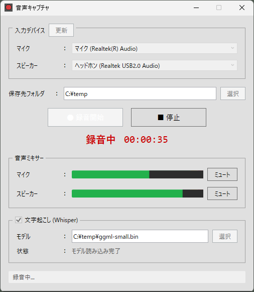

# AudioCaptureApp

Windows向け音声キャプチャアプリ。WASAPI Shared Mode で入力デバイスの音声を MP3 ファイルに録音します。

また、Whisper を利用してリアルタイムに簡易的な文字起こしができます。

## 機能

- Windows の音声入力デバイス（マイク ＆ スピーカー）を一覧から選択
- WASAPI Shared Mode で録音（デバイスを占有しない、Teams/Zoom と同時使用可能）
- MP3 形式（LAME エンコード）でリアルタイム保存
- 保存先フォルダの指定・永続化
- 録音経過時間のリアルタイム表示
- Whisper を用いた簡易文字起こし（マイクとスピーカーの識別あり、同一入力音声内の話者識別は無し）

## 画面キャプチャ



## 動作要件

- Windows 10 以降 (x64)
- .NET 8.0 Runtime

## インストール

1. [Release](https://github.com/otomac/audio-capture-app/releases) ページから最新版 zip ファイルをダウンロードする
2. 任意のフォルダに zip ファイルを展開する
3. `AudioCaptureApp.exe` を起動する

## Whisper モデルファイルの取得

- 本ツールのリリース媒体には、Whisper のモデルファイルは含まれていません
- 以下を参考に、別途モデルファイルを取得してください
  1. https://github.com/ggml-org/whisper.cpp からリポジトリを clone または Zip ダウンロードする
  2. コマンドラインから、 `models/download-ggml-model.cmd <size>` を実行し、ファイルを取得する
- `<size>` は `small` を推奨しますが、マシンスペックによって適切なモデルを選択してください

## 開発の手引き

以降のビルド手順は、ローカルPC上に .NET SDK がインストールされていることが前提です。

### ビルド

```bash
dotnet build AudioCaptureApp.sln
```

### 実行（動作確認）

```bash
dotnet run --project AudioCaptureApp
```

### 発行（スタンドアローン .exe）

```bash
dotnet publish AudioCaptureApp/AudioCaptureApp.csproj -c Release -r win-x64 --self-contained -p:PublishSingleFile=true -o publish
```

## 設定ファイル

- 保存場所: `%APPDATA%\AudioCaptureApp\settings.json`
- デフォルト保存先: `%USERPROFILE%\Documents\AudioCapture`

## 使用ライブラリ

- [NAudio](https://github.com/naudio/NAudio) - 音声録音 (WASAPI)
- [NAudio.Lame](https://github.com/Corey-M/NAudio.Lame) - MP3 エンコード
- [CommunityToolkit.Mvvm](https://github.com/CommunityToolkit/dotnet) - MVVM フレームワーク
- [Whisper.cpp](https://github.com/ggml-org/whisper.cpp) - OpenAI Whisper（文字起こしライブラリ）の C/C++実装

## ライセンス

MIT License
Copyright (c) 2026 otomac

NAudio.Lame は LGPL ライセンスの LAME を使用しています。商用配布時は要確認。
