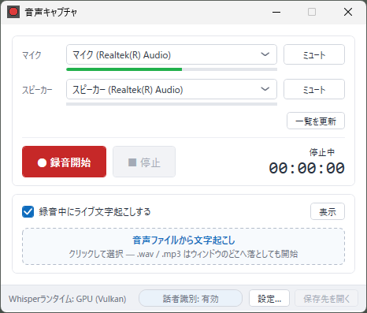

# AudioCaptureApp

Windows向け音声キャプチャアプリ。WASAPI Shared Mode で入力デバイスの音声を MP3 ファイルに録音します。

また、Whisper を利用して、ライブまたは録音済み音声ファイルを用いた文字起こしができます。

## 機能

### 音声録音

- Windows の音声入力デバイス（マイク ＆ スピーカー）を通した録音
  - デバイスを占有しないので、Teams/Zoom などの会議アプリと同時使用可能
- MP3 形式（LAME エンコード）でリアルタイム保存

### 文字起こし

- Whisper を用いたライブ文字起こし
  - マイクとスピーカーの識別あり
  - ライブ文字起こしでは同一入力音声内の話者識別は無し
  - 文字起こし状況を表示できるサブウィンドウを表示可能（起動直後は非表示）
- Whisper を用いた音声ファイルからの文字起こし
  - sherpa-onnx による話者識別（Speaker Dialization）
    - 同一音声内で `話者1` / `話者2` … を区別する
    - 話者識別は任意で有効にできる（既定は無効）
- **完全にローカルで処理します。** クラウド API は使わず、音声や文字起こし内容を外部へ送信しません。
  ネットワーク接続が無い環境でも動作します。
- 文字起こしはGPU（CUDA／Vulkan）を利用可能（処理が遅くなるが、GPUをOFFにすることも可能）

## 話者識別（Speaker Dialization）

- 音声ファイルからの文字起こしに限り、**同一音声内で話者を区別**して出力できます。

```text
[00:00:01 - 00:00:04] [ファイル] [話者1] 本日の会議を始めます。
[00:00:05 - 00:00:08] [ファイル] [話者2] 最初に一点確認があります。
[00:00:08 - 00:00:12] [ファイル] [話者1] はい、お願いします。
```

### 前提と制約

- **モデルファイルは別途事前のダウンロードが必要**
  - Whisper、sherpa-onnx ともに、リリースzipにモデルファイルを同梱していません
  - また、アプリケーション内でダウンロードしないため、起動前に事前にダウンロードし配置しておく必要があります
- **話者ID は音声ファイルの中でのみ有効**
  - 別のファイルの `話者1` が同一人物であることを意味しません
- **同一人物に対して複数の話者IDが割り当たる**
  - sherpa-onnx 自体の能力と本アプリケーションからの利用方法の関係で、同一人物でも複数の話者IDが割り当たるこことがあります
  - 話者ID の番号が大きく飛ぶ場合があります（必ずしも出現順に連番が割り振られるわけではない）
- **話者の区切りが正確でない場合がある**
  - 文字起こしを行う音声区間の区切り方の都合で、１つの文字起こし区間内に複数人の発言（特に相槌などの短い言葉）が含まれることがあります
  - 文字起こしデータを要約する場合には大きく影響しないため、厳密な話者区切りは採用していません
- **話者名は推定しない（Speaker Identification なし）**
  - 識別した話者はすべて `話者1`, `話者2` などの話者IDで表示します
  - 会話内容から話者名を推定することはありません
  - 声紋の登録も個人認証も行いません
- **話者識別（Speaker Dialization）はファイルからの文字起こしのみ**
  - 録音中のリアルタイム文字起こしには話者は付きません
    - 使用している Diarization API が音声全体を必要とするためです
    - 録音した MP3 を後からファイル文字起こしに掛けてください
    - 話者識別は音声全体をメモリに載せるため、**約 230MB/時間** を消費します

## 画面キャプチャ



## 動作要件

- Windows 10 以降 (x64)
- .NET 10.0 Runtime（Release 版の zip は self-contained のため、別途インストールは不要）

## インストール

1. [Release](https://github.com/otomac/audio-capture-app/releases) ページから最新版 zip ファイルをダウンロードする
2. 任意のフォルダに zip ファイルを展開する
3. `AudioCaptureApp.exe` を起動する

### Whisper モデルファイルの取得

- 本ツールのリリース媒体には、Whisper のモデルファイルは含まれていません
- 以下を参考に、別途モデルファイルを取得してください
  1. https://github.com/ggml-org/whisper.cpp からリポジトリを clone または Zip ダウンロードする
  2. コマンドラインから、 `models/download-ggml-model.cmd <size>` を実行し、ファイルを取得する
- `<size>` は `small` を推奨しますが、マシンスペックによって適切なモデルを選択してください

### sherpa-onnx モデルファイルの取得

- 本ツールのリリース媒体には、sherpa-onnx モデルファイルは含まれていません
- 以下から 2 種類を取得してください

1. **話者区間検出（segmentation）モデル** — pyannote 系
   <https://github.com/k2-fsa/sherpa-onnx/releases/tag/speaker-segmentation-models>
2. **話者埋め込み（speaker embedding）モデル** — 3D-Speaker 系など
   <https://github.com/k2-fsa/sherpa-onnx/releases/tag/speaker-recongition-models>

ダウンロードした `.onnx` を任意のフォルダへ置きます（既定の想定は `%APPDATA%\AudioCaptureApp\models\diarization\`）

### 設定

`%APPDATA%\AudioCaptureApp\settings.json` を直接編集します（UI からは切り替えできません）。

```json
{
  "SpeakerDiarizationEnabled": true,
  "SpeakerSegmentationModelPath": "C:\\Users\\<user>\\AppData\\Roaming\\AudioCaptureApp\\models\\diarization\\segmentation.onnx",
  "SpeakerEmbeddingModelPath": "C:\\Users\\<user>\\AppData\\Roaming\\AudioCaptureApp\\models\\diarization\\embedding.onnx",
  "SpeakerClusteringThreshold": 0.5,
  "KnownSpeakerCount": null,
  "SpeakerDiarizationThreads": 4
}
```

| キー | 意味 |
|---|---|
| `SpeakerDiarizationEnabled` | 話者ダイアライゼーションを行うか。`false`（既定）なら従来どおりの出力になる |
| `SpeakerSegmentationModelPath` | 話者区間検出モデルの絶対パス |
| `SpeakerEmbeddingModelPath` | 話者埋め込みモデルの絶対パス |
| `SpeakerClusteringThreshold` | 話者数が未知のときの分割のしやすさ（既定 0.5）。**小さくすると話者を細かく分け、大きくするとまとめます。**話者が分かれすぎるなら上げ、別人が混ざるなら下げてください。実測では **0.4 まで下げると 1 人だけの録音が 2 人に割れ**、**0.7 まで上げると別人の区別が失われました**。動かすなら 0.5〜0.6 の範囲に留めるのが安全です |
| `KnownSpeakerCount` | 参加者数を指定する。`null`（既定）なら閾値による自動判定。**指定は推奨しません** — 正しい人数を入れても精度が落ちることを実測しています（下の「話者 ID の読み方」を参照） |
| `SpeakerDiarizationThreads` | 推論スレッド数（既定は**論理コア数と 4 の小さいほう**）。**結果はスレッド数で変わりません**（1〜20 スレッドで話者区間が完全に一致することを実測済み）。速度だけの設定です。実測では 1 → 4 で 1.3 倍（2 分 42 秒の音声で 28.3 → 22.3 秒）。**4 を超えても速くならず、8 を超えると遅くなります**（20 スレッドでは 38.4 秒と 1 スレッドより遅い）。差が大きくなるのは他の処理と CPU を奪い合うときで、16 スレッド分の負荷の下では 1 スレッド 85 秒に対し 4 スレッド 47 秒でした。**既にある `settings.json` の値は自動では書き換わりません** — 古い既定の `1` が書かれている場合は、その行を消すか `4` に直してください |

モデルが見つからない場合や読み込めない場合は、どのモデルで失敗したかを示すエラーが出て
文字起こし自体が中止されます（話者欄が欠けた成果物を作らないため）。

### 話者 ID の読み方（実測にもとづく制約）

**話者 ID を「人物の一意な識別子」として扱わないでください。** 実測では、
話者 2 名の対話（2 分 42 秒 / 58 行）で **6 種**、15 分程度の会議で **36〜72 種**の ID が出ます。
同一人物が複数の ID に割れるためです（逆に、別人が 1 つの ID にまとまることもあります）。

- 相槌や短い割り込みは、**話者区間そのものが生成されないことがあります。**
  その場合、直前・直後の話者へ吸収されて出力されます。
- 断片化の主因は「ごく短い発話区間の話者埋め込みが安定しないこと」です。
  実測では、話者 ID の 33〜56% が**合計 2 秒未満しか話していない ID** で、
  それらが占める発話時間は全体の 3〜5% にすぎません。
- **なぜそうなるかも実測しました。** 話者埋め込みは、切り出しが短いほど
  「同じ人を同じと認める力」を失います。同一話者どうしの類似度は
  **0.25 秒で 0.31 / 1 秒で 0.51 / 3 秒で 0.76 / 10 秒で 0.90** と伸びるのに対し、
  別話者どうしは長さによらず 0.22〜0.44 のままです。
  **既定のしきい値 0.5 は、ちょうど「1 秒の区間の同一話者類似度」と同じ高さ**にあり、
  実際の話者区間は半数が 1 秒未満です。つまり**同じ人の区間の約半分がしきい値を越えられません。**
- **相槌や短い割り込みは、そもそも話者区間が作られません。** 正解の分かる音声で測ると、
  発話の交代が 1 秒程度の音声では**交代の 9% しか検出されず**、話者の当たり方は
  当て推量と同じでした（交代が 7 秒なら 92%、20 秒なら 98% 当たります）。

**設定で改善しようとしても効果は限定的です。** 埋め込みモデル 4 種
（campplus zh_en / eres2netv2 / NeMo TitaNet-large / WeSpeaker ResNet293）× 閾値 0.4〜0.7 を
実測しましたが、**既定以外はいずれも「正しく区別できていた箇所」を失いました**。
ID の数だけが減る設定はありますが、それは断片がまとまったのではなく
**別人を飲み込んだ**結果です。処理時間も 3〜12 倍になります。
`SpeakerClusteringThreshold` を 0.8 以上に上げるのと `KnownSpeakerCount` の指定は、
同じ理由で**逆効果**であることが分かっています。
**`KnownSpeakerCount` は正しい人数を入れても逆効果です** — 正解の分かる音声で測ると、
2 名の対話に `2` を指定した時点で正しく取れていた区別の 3/4 が失われ、
正解が全区間で分かる合成音声では**全員が 1 人にまとめられて正答率が 92% → 52%（＝当て推量）**に落ちました。
指定する値を 2〜6 のどこに振っても同じです。**人数は指定しないでください。**

> **「ID の数を減らしたい」場合の選択肢。** 埋め込みモデルを
> [WeSpeaker ResNet293](https://github.com/k2-fsa/sherpa-onnx/releases/tag/speaker-recongition-models)
> （`wespeaker_en_voxceleb_resnet293_LM.onnx`）に差し替えると、15 分の会議で ID が
> **45〜108 種 → 7〜11 種**まで減り、人数の見通しは付きやすくなります。ただし
> **短い応答の区別は失われ**（正解が分かっている音声では、既定なら取れていた区別を 1 つ落とします）、
> **処理時間が実時間の 1.4〜1.7 倍**になります（1 時間の会議に 1 時間半）。
> 既定にしないのはこのためです。用途に応じて選んでください。

> segmentation モデルについても、sherpa-onnx が配布する代替 2 種
> （reverb-diarization v1 / v2）を実測しましたが、精度は改善せず、**いずれも
> Rev Model Non-Production License（商用・本番利用が禁止）** です。既定の
> pyannote-segmentation-3.0 から変える理由は見つかっていません。
> 2026-08-23 時点で sherpa-onnx が配布する segmentation モデルはこの 3 種のままです
> （`speaker-segmentation-models` リリースの資産は 2024-12-15 以降更新されていません）。

### ライセンスの確認

**sherpa-onnx 本体のライセンスと、モデルのライセンスは別物です。混同しないでください。**

- sherpa-onnx（Apache-2.0）: <https://github.com/k2-fsa/sherpa-onnx/blob/master/LICENSE>
- 各モデル: 配布元のリリースページおよび元モデル（pyannote / 3D-Speaker 等）の
  ライセンス表記を**個別に確認してください**。モデルを再配布する場合は、必要な LICENSE / NOTICE を
  同梱する必要があります。本リポジトリはモデルを同梱していないため、その責任は配布者にあります。

## 開発の手引き

以降のビルド手順は、ローカルPC上に .NET SDK がインストールされていることが前提です。

### ビルド

```bash
dotnet build AudioCaptureApp.slnx
```

### 実行（動作確認）

```bash
dotnet run --project AudioCaptureApp
```

### 発行（スタンドアローン .exe）

```bash
dotnet publish AudioCaptureApp/AudioCaptureApp.csproj -c Release -r win-x64 --self-contained -p:PublishSingleFile=true -o publish
```

## 設定ファイル

- 保存場所: `%APPDATA%\AudioCaptureApp\settings.json`
- デフォルト保存先: `%USERPROFILE%\Documents\AudioCapture`

## 使用ライブラリ

- [NAudio](https://github.com/naudio/NAudio) - 音声録音 (WASAPI)
- [NAudio.Lame](https://github.com/Corey-M/NAudio.Lame) - MP3 エンコード
- [CommunityToolkit.Mvvm](https://github.com/CommunityToolkit/dotnet) - MVVM フレームワーク
- [Whisper.cpp](https://github.com/ggml-org/whisper.cpp) - OpenAI Whisper（文字起こしライブラリ）の C/C++実装
- [sherpa-onnx](https://github.com/k2-fsa/sherpa-onnx) - 話者ダイアライゼーション（Apache-2.0）。ネイティブランタイムは win-x64 のみ同梱

## ライセンス

MIT License
Copyright (c) 2026 otomac

NAudio.Lame は LGPL ライセンスの LAME を使用しています。商用配布時は要確認。

話者ダイアライゼーション用のモデルファイルは本リポジトリに含まれていません。利用・再配布の条件は各モデルの配布元で確認してください（sherpa-onnx 本体のライセンスとは別です）。
