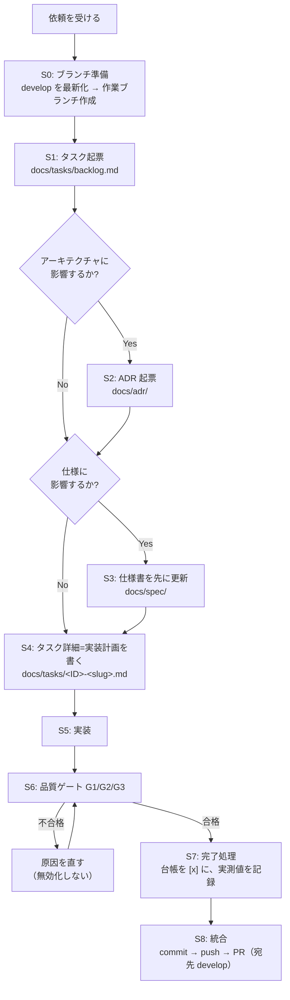

# 10 — 作業手順（Workflow）

[00-ways-of-working.md](./00-ways-of-working.md) の 4 つの法と横断ルールを、実際の作業順序に落としたもの。
どんな変更もこの順序を通る。

---

## 全体フロー



---

## S0 — ブランチ準備（横断ルール「ブランチ運用」）

**ソースにも台帳にも触る前に、作業ブランチを用意する。**

```powershell
git switch develop
git pull --ff-only origin develop
git switch -c feature-<slug>      # 修正は fix- / ハーネス・ビルド設定は maintenance-
```

- 接頭辞は `feature-` / `fix-` / `maintenance-` の 3 種
  （[00-ways-of-working.md #ブランチ運用](./00-ways-of-working.md#ブランチ運用)）。
- `<slug>` は英小文字とハイフン。タスク ID ではなく **何をするか** を書く
  （`fix-gpu-toggle-and-model-load`）。
- **1 タスク = 1 ブランチ。** S1 の起票（台帳・タスク票）もこのブランチ上で行い、PR の差分に含める。
- 途中で別の問題を見つけても、このブランチでは直さない（台帳に起票して次のブランチへ）。

> **`develop` / `main` / `master` 上で `.cs` / `.xaml` を編集しようとすると
> `guard-source-edit.ps1` が deny で止める。** これが「ブランチ運用」の強制点。
> `git switch` は不可逆な操作なので、実行前に依頼者の承認を取る。

## S1 — タスク起票（法 1）

1. `docs/tasks/backlog.md` に 1 行追加する。ID は `T` + 3 桁連番（既存の最大値 +1）。
2. 状態を `[ ]`（未着手）で登録し、着手時に `[~]`（進行中）へ変える。
   **`[~]` が 1 件も無い状態でソースを編集しようとするとフックが止める。**
3. 同時に `[~]` にしてよいタスクは **原則 1 件**。

> 粒度の目安：1 タスク＝1 つの目的。「録音停止時のファイル削除条件を直す」は 1 タスク。
> 「Dispose まわりの静的解析警告を潰す」も 1 タスク。この 2 つを 1 票にまとめない。

## S2 — ADR 起票（法 3、該当時のみ）

[00-ways-of-working.md 法 3](./00-ways-of-working.md#法-3--アーキテクチャ優先) に挙げた種類の変更なら、
実装前に `docs/adr/NNNN-<slug>.md` を [templates/adr.md](./templates/adr.md) の様式で書き、**承認を得る**。

判断に迷ったら：*「3 か月後の担当者が『なぜこうなっている？』と聞きそうか？」* → Yes なら ADR。

## S3 — 仕様書を先に更新（法 2、該当時のみ）

[50-spec-standards.md](./50-spec-standards.md) の対応表で更新対象の章を特定し、**実装前に** 直す。

- 機能の追加・変更・削除 → `01_requirements.md`（要件 ID を採番／改訂）
- 層構成・スレッドモデル・データフローの変更 → `02_architecture.md`
- 公開クラス／メソッドの増減 → `03_class_diagram.md`
- 処理順序の変更 → `04_sequence_diagram.md`

仕様に影響しない変更（内部リファクタリング・テスト追加・ビルド設定）ではこの手順を飛ばしてよい。
その場合、`guard-source-edit.ps1` の確認には「仕様非影響」と答えて進める。

## S4 — 実装計画を書く

`docs/tasks/<ID>-<slug>.md` を [templates/task.md](./templates/task.md) で作る。
複数ファイルに跨る変更では必須。1 ファイルの些細な変更なら台帳の 1 行で足りる。

計画に必ず含めるもの：

- **スコープ境界** — 何を変え、**何を変えないか**（変えないほうを太字で書く）
- **決定事項** — 実装中に蒸し返さないために固定した選択
- **変更ファイル一覧** — パスと変更内容
- **テスト一覧** — 追加・変更するテストメソッド名と、それが何を保証するか
- **未解決の質問** — 事実ではなく「判断」が必要なもの。既定案を添えて確認する

## S5 — 実装

- [20-architecture-standards.md](./20-architecture-standards.md) と
  [30-coding-standards.md](./30-coding-standards.md) に従う。
- 変更は小さく、レビュー可能に保つ。計画外のファイルに手を出さない。
- 計画から外れる必要が出たら、勝手に外れずタスク票を先に直す。

## S6 — 品質ゲート（法 4）

[40-quality-gates.md](./40-quality-gates.md) の G1 / G2 / G3 を **順に、全部** 実行する。

```powershell
dotnet build  AudioCaptureApp.slnx -c Debug
dotnet format AudioCaptureApp.slnx --verify-no-changes
dotnet test   AudioCaptureApp.slnx -c Debug
```

- 1 つでも落ちたら、**原因を直してから** 先へ進む。次のタスクに進んではいけない。
- アナライザー・テストの無効化で通すのは禁止。

## S7 — 完了処理

1. `docs/tasks/backlog.md` の該当行を `[x]` にする。
2. タスク詳細ファイルの末尾に **実測値** を記録する。

   ```
   ## 実行結果 (YYYY-MM-DD)
   - dotnet build : 警告 0 / エラー 0
   - dotnet format: 差分なし
   - dotnet test  : 42 件成功 / 0 件失敗 / 0 件スキップ
   ```

3. 仕様書を更新した場合、実装が計画とズレていないか読み直す。ズレていたら仕様書を実装に合わせる。

## S8 — 統合（commit / push / PR）

**S6 のゲートが 3 つとも緑になってから** 行う。緑でないうちはコミットしない（「途中まで push」もしない）。

```powershell
git add <変更したファイル>
git commit -m "T<NNN> <一言サマリ>"
git push -u origin <ブランチ名>
gh pr create --base develop --title "T<NNN> <一言サマリ>" --body "<目的・変更点・実測値>"
```

- **PR の宛先は `develop`。** `main` へは `develop` からのみ入る。
- コミットメッセージの先頭はタスク ID（`T123 GPU が使えない環境での判定を修正`）。
- PR 本文にはゲートの **実測値** を書く（「通った」ではなく「42 件成功 / 0 件失敗」）。
- `git add` / `commit` / `push` / `gh pr create` は **その都度** 明示的に依頼されたときだけ実行する。
  1 つの承認は別の操作の承認ではない（`protect-commands.ps1` が都度確認する）。

---

## よくある逸脱と、その扱い

| 状況 | 正しい対応 |
|---|---|
| 些細な 1 行修正なのでタスクは要らない気がする | 起票する。1 行で済むなら台帳の 1 行だけでよい。 |
| 実装してみたら仕様書の記述と違っていた | コードが事実。「仕様書が古い」タスクを起票し、仕様書を現実に合わせる。 |
| 静的解析が既存コードの警告で落ちる | そのタスクの変更に起因する警告なら直す。既存の技術的負債なら [40-quality-gates.md](./40-quality-gates.md) の負債セクションを参照し、別タスクとして起票する。 |
| テストが落ちるが、自分の変更とは無関係に見える | 「無関係に見える」で片付けない。原因を特定し、無関係だと確認できたら別タスクで起票して、その旨を報告する。 |
| 作業中に別の問題を見つけた | 直さない。台帳に起票して、今のタスクを終える。 |
| `develop` 上で作業を始めてしまった | 気づいた時点で止める。`git switch -c <接頭辞>-<slug>` で未コミットの変更ごと作業ブランチへ移す（承認を取ってから）。 |
| 小さい変更なのでブランチを切るまでもない気がする | 切る。1 行の変更でも PR の差分が「そのタスクだけ」になることに価値がある。 |
| ゲートが赤いが、区切りが良いので一度コミットしたい | しない。緑にしてからコミットする。どの時点が緑だったか分からなくなる。 |
