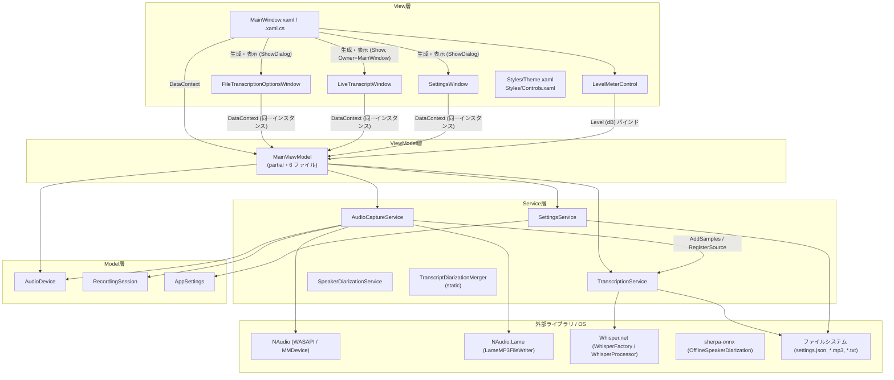
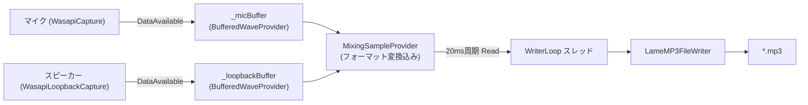
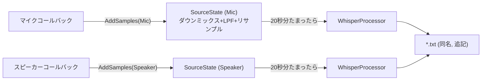
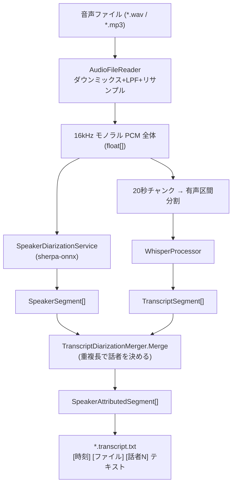

# ソフトウェアアーキテクチャ

## 1. 技術スタック

| 項目 | 内容 |
|---|---|
| 言語 | C# 14 / .NET 10 (`net10.0-windows`) |
| UI | WPF + CommunityToolkit.Mvvm 8.3.2（`[ObservableProperty]` / `[RelayCommand]` ソースジェネレータ） |
| 録音 | NAudio 2.2.1 + NAudio.Wasapi 2.2.1（WASAPI Shared Mode） |
| MP3 エンコード | NAudio.Lame 2.1.0（`LameMP3FileWriter`） |
| 文字起こし | Whisper.net 1.9.0 + Whisper.net.Runtime / Runtime.Cuda / Runtime.Vulkan（GGML モデル） |
| 話者ダイアライゼーション | sherpa-onnx 1.13.5（`org.k2fsa.sherpa.onnx`、ネイティブランタイムは win-x64 のみ同梱）。ファイル文字起こし経路でのみ使用し、既定は無効（[ADR-0003](../adr/0003-speaker-diarization-with-sherpa-onnx.md)） |
| 設定永続化 | System.Text.Json（`settings.json`） |
| テスト | xUnit（`AudioCaptureApp.Tests`） |

## 2. レイヤー構成

[CLAUDE.md](../../CLAUDE.md) の方針に従い、Models / ViewModels / Services の 3 層構成を採用する。ViewModel は `MainViewModel` **1 クラス**に集約している。ファイルは機能単位で `partial` に割っている（[ADR-0005](../adr/0005-mainviewmodel-split.md)。シンプル優先）。

### 各層の責務

- **View層**（`MainWindow.xaml(.cs)`, `FileTranscriptionOptionsWindow`, `LiveTranscriptWindow`, `SettingsWindow`, `Controls/LevelMeterControl`, `Styles/`）
  UI 表示とユーザー操作の受け付け。ドラッグ＆ドロップのイベントハンドリングと、`MainViewModel` へのバインディングのみを持ち、業務ロジックは持たない。
  補助ウィンドウ（`FileTranscriptionOptionsWindow` / `LiveTranscriptWindow` / `SettingsWindow`）は**自前の状態を持たず**、`MainWindow` と同じ `MainViewModel` インスタンスを `DataContext` として共有する。生成・表示・アクティブ化は `MainWindow` のコードビハインドが行い、`MainViewModel` は「開いてほしい」を `FileTranscriptionRequested` / `LiveTranscriptRequested` / `SettingsRequested` イベントで通知するだけである（依存方向 View → ViewModel を守るため）。詳細と根拠は [ADR-0002](../adr/0002-secondary-windows-share-mainviewmodel.md)。
  `Styles/` は `App.xaml` の `MergedDictionaries` から読み込む `ResourceDictionary` で、コントロールの `Style` と `ControlTemplate` だけを持つ。UI ライブラリは導入していない（`CLAUDE.md`「ライブラリ追加は個別承認制」）。
- **ViewModel層**（`ViewModels/MainViewModel*.cs`）
  UI 状態（録音中／設定値／進捗等）の保持、コマンド（`[RelayCommand]`）によるユーザー操作のハンドリング、Service 層の呼び出しオーケストレーション、`DispatcherTimer` による定期更新（メーター 50ms／経過時間 1s）を担う。
  **クラスもインスタンスも `MainViewModel` 1 つで、ファイルだけを機能単位に `partial` で割っている**（[ADR-0005](../adr/0005-mainviewmodel-split.md) 案 D）。
  したがってファイル間で状態を同期する仕組みは存在しない — 同じオブジェクトだからである。

  | ファイル | 担当 |
  |---|---|
  | `MainViewModel.cs` | Service の保持、コンストラクター、`IsRecording` / `IsStopping` / `IsTranscribingFile` と `IsNotBusy`、`StatusMessage`、`LastResultPath`、保存先フォルダ、成果物フォルダを開く、設定の保存、`Dispose` |
  | `MainViewModel.Devices.cs` | デバイスの一覧・選択・モニタリング、ミュート、レベルメーター |
  | `MainViewModel.Recording.cs` | 録音の開始／停止、録音状態の表示、終了時の確認と後始末 |
  | `MainViewModel.Transcription.cs` | Whisper モデルの読み込み、GPU 切り替え、言語の選択、話者識別の状態表示 |
  | `MainViewModel.FileTranscription.cs` | 音声ファイルからの文字起こし（オプション指定ダイアログ・開始時刻の推定を含む） |
  | `MainViewModel.LiveTranscript.cs` | 文字起こし表示ウィンドウへ流す行の蓄積と反映 |

  **`ViewModels/` に `MainViewModel` 以外のクラスは置かない**（ADR-0005 の規則 3）。
  ウィンドウ単位の ViewModel へ分ける案は、①全ファイル合計が 1,500 行を超えたとき、
  ②5 枚目のウィンドウを足すとき に再評価する。
- **Service層**（`Services/AudioCaptureService`, `TranscriptionService`, `SpeakerDiarizationService`, `TranscriptDiarizationMerger`, `SettingsService`）
  NAudio・Whisper.net・ファイル I/O など外部リソースを直接操作する。ViewModel から独立してテスト可能な static ヘルパー（`BytesToFloats` / `CalculatePeak` / `SplitVoicedRegions` など）を公開し、`AudioCaptureApp.Tests` から `InternalsVisibleTo` 経由で検証する。
- **Model層**（`Models/AudioDevice`, `RecordingSession`, `AppSettings`, `SpeakerSegment` / `TranscriptSegment` / `SpeakerAttributedSegment`）
  可変・不変データを保持する POCO。ロジックを持たない。

## 3. コンポーネント間の主要な依存関係

- `MainWindow` は `MainViewModel` を直接 `new` して `DataContext` に設定する（DI コンテナは使用しない、シンプル優先の方針）。補助ウィンドウにも同じインスタンスを渡す（[ADR-0002](../adr/0002-secondary-windows-share-mainviewmodel.md)）。補助ウィンドウは `Owner` に `MainWindow` を設定するため、メインウィンドウを閉じると WPF の既定動作で一緒に閉じる。
- `MainViewModel` は `AudioCaptureService` / `TranscriptionService` / `SettingsService` をフィールドとして保持し、直接インスタンス化する。
- `AudioCaptureService` はライブ文字起こしのために `TranscriptionService` への参照を `SetTranscriptionService` で受け取る（null 許容、疎結合）。録音中のみ音声サンプルを `AddSamples` で渡す。
- `TranscriptionService` は `AudioCaptureService` を一切参照しない（一方向依存）。
- `MainViewModel` は話者ダイアライゼーションが有効な設定のときだけ `SpeakerDiarizationService` を生成して保持し、`Dispose` で解放する。無効なら `null` のままにする。
- `TranscriptionService.TranscribeFileAsync` は `SpeakerDiarizationService?` を**引数で受け取るだけ**であり、フィールドとして保持も破棄もしない。`null` なら Diarization を行わない従来経路を走る。sherpa-onnx への依存は `SpeakerDiarizationService` の中だけに閉じている（[ADR-0003](../adr/0003-speaker-diarization-with-sherpa-onnx.md) 争点 3）。
- `SpeakerDiarizationService` は `TranscriptionService` も Whisper.net も一切参照しない。両エンジンは同じ音声を独立に解析し、結果の統合は `TranscriptDiarizationMerger`（static・純粋関数）だけが担う（REQ-TRX-DIA-04）。

## 4. スレッドモデル

本アプリは UI スレッドに加え、複数のバックグラウンドスレッド／コールバックスレッドが協調して動作する。

| スレッド | 起点 | 役割 |
|---|---|---|
| UI スレッド | WPF Dispatcher | ユーザー操作、データバインディング更新、`DispatcherTimer`（メーター更新・経過時間更新） |
| マイクキャプチャコールバック | `WasapiCapture.DataAvailable`（NAudio 内部スレッド） | マイク音声をバッファへ追加、ピークレベル算出、（録音中は）文字起こしバッファへ追加 |
| ループバックキャプチャコールバック | `WasapiLoopbackCapture.DataAvailable`（NAudio 内部スレッド） | スピーカー音声をバッファへ追加、ピークレベル算出、（録音中は）文字起こしバッファへ追加 |
| `AudioMixerWriter` | `AudioCaptureService.WriterLoop`（録音中のみ起動する専用 `Thread`） | 20ms 周期でミキサーから読み出し、MP3 へストリーミング書き込み |
| `WhisperTranscription` | `TranscriptionService.TranscriptionLoop`（ライブ文字起こしセッション中のみ起動する専用 `Thread`） | 1 秒周期で各音声ソースのバッファを確認し、閾値到達分を Whisper で処理 |
| ハードウェアミュート通知 | `AudioEndpointVolume.OnVolumeNotification`（OS コールバック） | OS 側のミュート変更をアプリへ通知（非 UI スレッド） |
| `Task.Run` ワーカー | `MainViewModel.StopRecordingAsync` / `TryLoadWhisperModel` / `RunFileTranscriptionAsync` | 録音停止・モデルロード・ファイル文字起こしなど時間のかかる処理を UI スレッドから退避 |
| sherpa-onnx ネイティブ推論 | `SpeakerDiarizationService.Diarize`（上記 `Task.Run` ワーカーから同期的に呼ぶ） | 話者ダイアライゼーション。`OfflineSpeakerDiarization` はスレッド安全性が保証されていないため、`lock` で 1 度に 1 呼び出しへ直列化する（REQ-TRX-DIA-10） |

UI スレッド以外からプロパティを更新する箇所（`MicMuteChangedExternally`、`TranscriptionService.Error`/`RuntimeInfo`、`AudioCaptureService.RecordingError`）はすべて `Application.Current.Dispatcher.BeginInvoke` を介して UI スレッドに戻す（[CLAUDE.md](../../CLAUDE.md) の開発ルールに準拠）。

## 5. データフロー概要

### 5.1 録音・ミキシング・保存

### 5.2 文字起こし（ライブ）

### 5.3 文字起こし（ファイル・話者ダイアライゼーション有効時）

無効時は従来どおり、読み込みながら 20 秒チャンクを順に処理して 1 行ずつ書き出す（5.2 と同じ流れをファイル読み込み側で行う）。
**有効時のみ**下図の流れになる。Diarization API が音声全体を要求するため、デコード結果を一度メモリへ載せる（NFR-07）。

**Diarization を先に走らせる。** 失敗（モデル未配置・破損・レート不一致）は Whisper を 1 秒も回す前に
判明させたいためである（REQ-TRX-DIA-11）。

## 6. 永続化されるデータ

| データ | 保存先 | 備考 |
|---|---|---|
| アプリ設定 | `%APPDATA%\AudioCaptureApp\settings.json` | `SettingsService` が JSON で読み書き |
| 録音ファイル | `<OutputFolder>\yyyyMMdd_HHmmss.mp3`（既定 `%USERPROFILE%\Documents\AudioCapture`） | `AudioCaptureService.StartRecording` |
| ライブ文字起こし結果 | 録音ファイルと同名の `.txt` | `TranscriptionService.StartSession` |
| ファイル文字起こし結果 | `{入力ファイル名}.transcript.txt` | `TranscriptionService.BuildTranscriptPath` |
| Whisper モデル | 既定 `%APPDATA%\AudioCaptureApp\models\ggml-small.bin`（ユーザー変更可） | `AppSettings.WhisperModelPath` |

## 7. エラーハンドリング方針

- Service 層は例外を握りつぶさず、原則として `InvalidOperationException` として再送出するか、`Error`/`RecordingError` イベントで非同期に通知する。
- ViewModel は Service からの例外・イベントを捕捉し、`StatusMessage` にユーザー向けメッセージとして表示する（例外の握り潰しではなく UI へのフィードバックに変換）。
- デバイス固有の機能制限（`AudioEndpointVolume` 非対応等）は例外を catch した上で機能を縮退させ、処理継続を優先する（ソフトミュートへのフォールバック等）。
