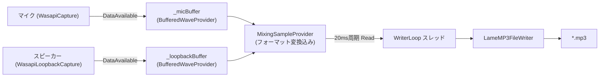
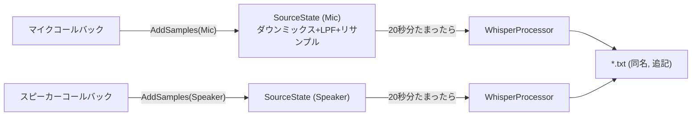
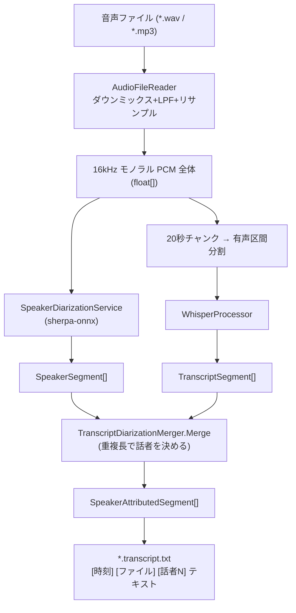

# ソフトウェアアーキテクチャ

## 1. 技術スタック

| 項目 | 内容 |
|---|---|
| 言語 | C# 14 / .NET 10 (`net10.0-windows`) |
| UI | WPF + CommunityToolkit.Mvvm 8.3.2（`[ObservableProperty]` / `[RelayCommand]` ソースジェネレータ） |
| 録音 | NAudio 2.2.1 + NAudio.Wasapi 2.2.1（WASAPI Shared Mode） |
| MP3 エンコード | NAudio.Lame 2.1.0（`LameMP3FileWriter`） |
| 文字起こし | Whisper.net 1.9.0 + Whisper.net.Runtime / Runtime.Cuda / Runtime.Vulkan（GGML モデル） |
| 話者ダイアライゼーション | sherpa-onnx 1.13.5（`org.k2fsa.sherpa.onnx`、ネイティブランタイムは win-x64 のみ同梱）。ファイル文字起こし経路でのみ使用し、既定は無効（[ADR-0003](../adr/0003-speaker-diarization-with-sherpa-onnx.md)） |
| 設定永続化 | System.Text.Json（`settings.json`） |
| テスト | xUnit（`AudioCaptureApp.Tests`） |
| 配布 | win-x64 の self-contained 発行（.NET ランタイム同梱の zip）。同梱ランタイムのうち `System.Net.Mail.dll` は未使用のため除外する（ウイルスバスターがメールクライアント機能として警告するため。T180）。**`System.Net.Mail` 名前空間は使わない** — 使うなら `AudioCaptureApp.csproj` の除外ターゲットを外すこと。zip の直下（`AudioCaptureApp.exe` と同じ階層）には発行物に加えて `VERSION` と `README.md` を同梱する（T189）。`VERSION` はリポジトリ直下のファイルで、リリースバージョンを 1 行で書く（リリースタグ `release_<バージョン>` の `<バージョン>` 部分。例 `2026.09.23`）。`release_*` タグのビルドでは `VERSION` がタグと一致しなければ CI が失敗する |

## 2. レイヤー構成

[CLAUDE.md](../../CLAUDE.md) の方針に従い、Models / ViewModels / Services の 3 層構成を採用する。ViewModel は**ウィンドウ 1 枚に 1 クラス**で、`MainViewModel` が親として子（補助ウィンドウの ViewModel）を生成・保持する。各クラスのファイルは機能単位で `partial` に割っている（[ADR-0008](../adr/0008-per-window-viewmodels.md)）。

```mermaid
graph TB
    subgraph View["View層"]
        MW["MainWindow.xaml / .xaml.cs"]
        FTW["FileTranscriptionOptionsWindow"]
        LTW["LiveTranscriptWindow"]
        SW["SettingsWindow"]
        WMW["WhisperModelsWindow"]
        RMW["RecordingMetadataWindow"]
        LMC["LevelMeterControl"]
        STY["Styles/Theme.xaml
Styles/Controls.xaml"]
    end

    subgraph ViewModel["ViewModel層"]
        MVM["MainViewModel
(partial・6 ファイル)"]
        SVM["SettingsViewModel"]
        WMVM["WhisperModelsViewModel"]
        FTVM["FileTranscriptionViewModel
(partial・3 ファイル)"]
        RMVM["RecordingMetadataViewModel"]
        LTVM["LiveTranscriptViewModel"]
    end

    subgraph Service["Service層"]
        ACS["AudioCaptureService"]
        TS["TranscriptionService"]
        SDS["SpeakerDiarizationService"]
        TDM["TranscriptDiarizationMerger
(static)"]
        SS["SettingsService"]
    end

    subgraph Model["Model層"]
        AD["AudioDevice"]
        RS["RecordingSession"]
        AS["AppSettings"]
    end

    subgraph External["外部ライブラリ / OS"]
        NAudio["NAudio (WASAPI / MMDevice)"]
        Lame["NAudio.Lame (LameMP3FileWriter)"]
        Whisper["Whisper.net (WhisperFactory / WhisperProcessor)"]
        Sherpa["sherpa-onnx (OfflineSpeakerDiarization)"]
        FS["ファイルシステム (settings.json, *.mp3, *.txt, *.json)"]
    end

    MW -->|"DataContext"| MVM
    MW -->|"生成・表示 (ShowDialog)"| FTW
    MW -->|"生成・表示 (Show, Owner=MainWindow)"| LTW
    MW -->|"生成・表示 (ShowDialog)"| SW
    SW -->|"生成・表示 (ShowDialog, Owner=SettingsWindow)"| WMW
    MW -->|"生成・表示 (ShowDialog)"| RMW
    FTW -->|"DataContext"| FTVM
    LTW -->|"DataContext"| LTVM
    SW -->|"DataContext"| SVM
    WMW -->|"DataContext"| WMVM
    RMW -->|"DataContext"| RMVM
    MW --> LMC
    LMC -->|"Level (dB) バインド"| MVM

    MVM -->|"生成・保持"| SVM
    MVM -->|"生成・保持"| FTVM
    MVM -->|"生成・保持"| RMVM
    MVM -->|"生成・保持"| LTVM
    SVM -->|"生成・保持"| WMVM
    SVM -.->|"親の状態を読み書き"| MVM
    WMVM -.->|"一覧を編集"| SVM
    FTVM -.->|"親の状態を読み書き"| MVM
    RMVM -.->|"親の状態を読み書き"| MVM

    MVM --> ACS
    MVM --> TS
    MVM --> SS
    MVM --> AD

    ACS --> RS
    ACS --> AD
    ACS -->|"AddSamples / RegisterSource"| TS
    ACS --> NAudio
    ACS --> Lame

    TS --> Whisper
    TS --> FS

    SS --> AS
    SS --> FS
```

### 各層の責務

- **View層**（`MainWindow.xaml(.cs)`, `FileTranscriptionOptionsWindow`, `LiveTranscriptWindow`, `SettingsWindow`, `WhisperModelsWindow`, `RecordingMetadataWindow`, `Controls/LevelMeterControl`, `Styles/`）
  UI 表示とユーザー操作の受け付け。ドラッグ＆ドロップのイベントハンドリングと、それぞれの ViewModel へのバインディングのみを持ち、業務ロジックは持たない。
  補助ウィンドウ（`FileTranscriptionOptionsWindow` / `LiveTranscriptWindow` / `SettingsWindow` / `WhisperModelsWindow` / `RecordingMetadataWindow`）は**自前の状態を持たず**、`MainViewModel` が保持するそれぞれの ViewModel（子）を `DataContext` にする。生成・表示・アクティブ化は `MainWindow` のコードビハインドが行い（`WhisperModelsWindow` だけは、モーダルな `SettingsWindow` の上に出すため `SettingsWindow` のコードビハインドが生成し `Owner` にする）、ViewModel は「開いてほしい」を `FileTranscriptionRequested` / `LiveTranscriptRequested` / `SettingsRequested` / `RecordingMetadataRequested`（`MainViewModel`）と `WhisperModelsRequested`（`SettingsViewModel`）のイベントで通知するだけである（依存方向 View → ViewModel を守るため）。詳細と根拠は [ADR-0008](../adr/0008-per-window-viewmodels.md)（イベントと生成の規則は [ADR-0002](../adr/0002-secondary-windows-share-mainviewmodel.md) から引き継いだもの）。
  `Styles/` は `App.xaml` の `MergedDictionaries` から読み込む `ResourceDictionary` で、コントロールの `Style` と `ControlTemplate` だけを持つ。UI ライブラリは導入していない（`CLAUDE.md`「ライブラリ追加は個別承認制」）。
- **ViewModel層**（`ViewModels/*ViewModel*.cs`）
  UI 状態（録音中／設定値／進捗等）の保持、コマンド（`[RelayCommand]`）によるユーザー操作のハンドリング、Service 層の呼び出しオーケストレーション、`DispatcherTimer` による定期更新（メーター 50ms／経過時間 1s）を担う。
  **ウィンドウ 1 枚に ViewModel 1 つ**で、`MainViewModel`（メインウィンドウ）が親として子を 1 度だけ生成し、アプリの終了まで保持する（[ADR-0008](../adr/0008-per-window-viewmodels.md)）。

  | ViewModel（ファイル） | ウィンドウ | 担当 |
  |---|---|---|
  | `MainViewModel`（`MainViewModel.cs`） | `MainWindow` | Service・設定の実体と子 ViewModel の保持、コンストラクター、**共有状態**（`IsRecording` / `IsStopping` / `IsTranscribingFile` と `IsNotBusy`、`StatusMessage`、`LastResultPath`、`LastTranscriptionError`）、成果物フォルダを開く、設定の保存（子の担当する項目も集める）、`Dispose` |
  | 〃（`MainViewModel.Devices.cs`） | 〃 | デバイスの一覧・選択・モニタリング、ミュート、レベルメーター |
  | 〃（`MainViewModel.Recording.cs`） | 〃 | 録音の開始／停止、録音状態の表示、終了時の確認と後始末 |
  | 〃（`MainViewModel.Transcription.cs`） | 〃 | 話者識別の状態表示、ライブ文字起こしの ON/OFF |
  | 〃（`MainViewModel.AutoStart.cs`） | 〃 | 録音の自動開始（マイク音量の監視。レベルメーターのタイマーに相乗りする） |
  | 〃（`MainViewModel.Windows.cs`） | 〃 | 補助ウィンドウを開く入口（子に対象を渡してから表示を要求する） |
  | `SettingsViewModel` | `SettingsWindow` | 保存先フォルダ、録音の自動開始の ON/OFF、ライブ文字起こしの言語、GPU の使用、**Whisper モデルの登録一覧とライブ用の選択**、モデルの読み込み |
  | `WhisperModelsViewModel` | `WhisperModelsWindow` | モデル管理ダイアログの編集状態（追加・名前変更・削除・並び替え）。一覧そのものは `SettingsViewModel` のもの |
  | `FileTranscriptionViewModel`（`.cs` / `.Run.cs` / `.StartTime.cs`） | `FileTranscriptionOptionsWindow` | 音声ファイルからの文字起こしの入力（開始時刻・言語・モデル・話者識別・メタデータ）、処理の進行（進捗・中止）、開始時刻の自動入力（REQ-TRX-FILE-15） |
  | `RecordingMetadataViewModel` | `RecordingMetadataWindow` | 録音停止時のメタデータ入力（会議名・実施日時・参加者）、JSON の書き出しと改名の指示 |
  | `LiveTranscriptViewModel` | `LiveTranscriptWindow` | 文字起こし表示ウィンドウへ流す行の蓄積と反映 |

  **共有する状態は 1 か所に置き、写しを持たない**（ADR-0008 規則 3）。子はコンストラクターで親を受け取り、親の値を読み書きする。
  子が親の値を画面に出すときは読み取り専用の転送プロパティ（例: `SettingsViewModel.IsNotBusy`）で、**XAML のバインド名は子へ移しても変えていない**（規則 5）。
  状態の変化の中継は次の 2 か所だけである（規則 4）。
  - `FileTranscriptionViewModel.SetTranscribing` — `IsTranscribingFile` の唯一の書き手。親のフラグを書き、ダイアログ側の通知もまとめて出す。
  - `SettingsViewModel.OnMainPropertyChanged` — 親の `IsNotBusy` の変化を、設定ウィンドウの表示と操作の可否へ中継する。

  再評価の契機は、①1 つの ViewModel の全ファイル合計が 1,500 行を超えたとき、②中継が 3 か所目になったとき（ADR-0008 規則 8）。
- **Service層**（`Services/AudioCaptureService`, `TranscriptionService`, `SpeakerDiarizationService`, `TranscriptDiarizationMerger`, `SettingsService`, `AutoStartTrigger`, `RecordingMetadataFile`（static））
  NAudio・Whisper.net・ファイル I/O など外部リソースを直接操作する。ViewModel から独立してテスト可能な static ヘルパー（`BytesToFloats` / `CalculatePeak` / `SplitVoicedRegions` など）を公開し、`AudioCaptureApp.Tests` から `InternalsVisibleTo` 経由で検証する。
- **Model層**（`Models/AudioDevice`, `RecordingSession`, `AppSettings`, `WhisperModelEntry`, `RecordingMetadata`, `SpeakerSegment` / `TranscriptSegment` / `SpeakerAttributedSegment`）
  可変・不変データを保持する POCO。ロジックを持たない。

## 3. コンポーネント間の主要な依存関係

- `MainWindow` は `MainViewModel` を直接 `new` して `DataContext` に設定する（DI コンテナは使用しない、シンプル優先の方針）。補助ウィンドウには `MainViewModel` が保持する子 ViewModel（`Settings` / `FileTranscription` / `RecordingMetadata` / `LiveTranscript`）を渡す（[ADR-0008](../adr/0008-per-window-viewmodels.md)）。補助ウィンドウは `Owner` に `MainWindow` を設定するため、メインウィンドウを閉じると WPF の既定動作で一緒に閉じる。
- `MainViewModel` は `AudioCaptureService` / `TranscriptionService` / `SettingsService` をフィールドとして保持し、直接インスタンス化する。子 ViewModel はこれらを親の `internal` プロパティ経由で使い、自分では生成しない。
- `AudioCaptureService` はライブ文字起こしのために `TranscriptionService` への参照を `SetTranscriptionService` で受け取る（null 許容、疎結合）。録音中のみ音声サンプルを `AddSamples` で渡す。
- `TranscriptionService` は `AudioCaptureService` を一切参照しない（一方向依存）。
- `MainViewModel` は話者ダイアライゼーションが有効な設定のときだけ `SpeakerDiarizationService` を生成して保持し、`Dispose` で解放する。無効なら `null` のままにする。
- `TranscriptionService.TranscribeFileAsync` は `SpeakerDiarizationService?` を**引数で受け取るだけ**であり、フィールドとして保持も破棄もしない。`null` なら Diarization を行わない従来経路を走る。sherpa-onnx への依存は `SpeakerDiarizationService` の中だけに閉じている（[ADR-0003](../adr/0003-speaker-diarization-with-sherpa-onnx.md) 争点 3）。
- `SpeakerDiarizationService` は `TranscriptionService` も Whisper.net も一切参照しない。両エンジンは同じ音声を独立に解析し、結果の統合は `TranscriptDiarizationMerger`（static・純粋関数）だけが担う（REQ-TRX-DIA-04）。

## 4. スレッドモデル

本アプリは UI スレッドに加え、複数のバックグラウンドスレッド／コールバックスレッドが協調して動作する。

| スレッド | 起点 | 役割 |
|---|---|---|
| UI スレッド | WPF Dispatcher | ユーザー操作、データバインディング更新、`DispatcherTimer`（メーター更新・経過時間更新） |
| マイクキャプチャコールバック | `WasapiCapture.DataAvailable`（NAudio 内部スレッド） | マイク音声をバッファへ追加、ピークレベル算出、（録音中は）文字起こしバッファへ追加 |
| ループバックキャプチャコールバック | `WasapiLoopbackCapture.DataAvailable`（NAudio 内部スレッド） | スピーカー音声をバッファへ追加、ピークレベル算出、（録音中は）文字起こしバッファへ追加 |
| `AudioMixerWriter` | `AudioCaptureService.WriterLoop`（録音中のみ起動する専用 `Thread`） | 20ms 周期でミキサーから読み出し、MP3 へストリーミング書き込み |
| `WhisperTranscription` | `TranscriptionService.TranscriptionLoop`（ライブ文字起こしセッション中のみ起動する専用 `Thread`） | 1 秒周期で各音声ソースのバッファを確認し、閾値到達分を Whisper で処理 |
| ハードウェアミュート通知 | `AudioEndpointVolume.OnVolumeNotification`（OS コールバック） | OS 側のミュート変更をアプリへ通知（非 UI スレッド） |
| `Task.Run` ワーカー | `MainViewModel.StopRecordingAsync` / `SettingsViewModel.TryLoadWhisperModel` / `FileTranscriptionViewModel.RunFileTranscriptionAsync` | 録音停止・モデルロード・ファイル文字起こしなど時間のかかる処理を UI スレッドから退避 |
| sherpa-onnx ネイティブ推論 | `SpeakerDiarizationService.Diarize`（上記 `Task.Run` ワーカーから同期的に呼ぶ） | 話者ダイアライゼーション。`OfflineSpeakerDiarization` はスレッド安全性が保証されていないため、`lock` で 1 度に 1 呼び出しへ直列化する（REQ-TRX-DIA-10） |

UI スレッド以外からプロパティを更新する箇所（`MicMuteChangedExternally`、`TranscriptionService.Error`/`RuntimeInfo`、`AudioCaptureService.RecordingError`）はすべて `Application.Current.Dispatcher.BeginInvoke` を介して UI スレッドに戻す（[CLAUDE.md](../../CLAUDE.md) の開発ルールに準拠）。

## 5. データフロー概要

### 5.1 録音・ミキシング・保存

```mermaid
flowchart LR
    Mic["マイク (WasapiCapture)"] -->|DataAvailable| MicBuf["_micBuffer\n(BufferedWaveProvider)"]
    Speaker["スピーカー (WasapiLoopbackCapture)"] -->|DataAvailable| LoopBuf["_loopbackBuffer\n(BufferedWaveProvider)"]
    MicBuf --> Mixer["MixingSampleProvider\n(フォーマット変換込み)"]
    LoopBuf --> Mixer
    Mixer -->|20ms周期 Read| Writer["WriterLoop スレッド"]
    Writer --> Lame["LameMP3FileWriter"]
    Lame --> Mp3["*.mp3"]
```

### 5.2 文字起こし（ライブ）

```mermaid
flowchart LR
    MicBuf2["マイクコールバック"] -->|"AddSamples(Mic)"| SrcMic["SourceState (Mic)\nダウンミックス+LPF+リサンプル"]
    LoopBuf2["スピーカーコールバック"] -->|"AddSamples(Speaker)"| SrcSpk["SourceState (Speaker)"]
    SrcMic -->|20秒分たまったら| Whisper1["WhisperProcessor"]
    SrcSpk -->|20秒分たまったら| Whisper2["WhisperProcessor"]
    Whisper1 --> Txt["*.txt (同名, 追記)"]
    Whisper2 --> Txt
```

### 5.3 文字起こし（ファイル・話者ダイアライゼーション有効時）

無効時は従来どおり、読み込みながら 20 秒チャンクを順に処理して 1 行ずつ書き出す（5.2 と同じ流れをファイル読み込み側で行う）。
**有効時のみ**下図の流れになる。Diarization API が音声全体を要求するため、デコード結果を一度メモリへ載せる（NFR-07）。

```mermaid
flowchart TB
    File["音声ファイル (*.wav / *.mp3)"] --> Dec["AudioFileReader
ダウンミックス+LPF+リサンプル"]
    Dec --> Pcm["16kHz モノラル PCM 全体
(float[])"]
    Pcm --> Dia["SpeakerDiarizationService
(sherpa-onnx)"]
    Pcm --> Chunk["20秒チャンク → 有声区間分割"]
    Chunk --> Whisper["WhisperProcessor"]
    Dia --> SS2["SpeakerSegment[]"]
    Whisper --> TS2["TranscriptSegment[]"]
    SS2 --> Merge["TranscriptDiarizationMerger.Merge
(重複長で話者を決める)"]
    TS2 --> Merge
    Merge --> Out["SpeakerAttributedSegment[]"]
    Out --> Txt2["*.transcript.txt
[時刻] [ファイル] [話者N] テキスト"]
```

**Diarization を先に走らせる。** 失敗（モデル未配置・破損・レート不一致）は Whisper を 1 秒も回す前に
判明させたいためである（REQ-TRX-DIA-11）。

## 6. 永続化されるデータ

| データ | 保存先 | 備考 |
|---|---|---|
| アプリ設定 | `%APPDATA%\AudioCaptureApp\settings.json` | `SettingsService` が JSON で読み書き |
| 録音ファイル | `<OutputFolder>\yyyyMMdd_HHmmss.mp3`（既定 `%USERPROFILE%\Documents\AudioCapture`）。メタデータの会議名があれば停止後に `yyyyMMdd_HHmmss_会議名.mp3` へ改名 | `AudioCaptureService.StartRecording` / `RenameSessionFiles` |
| ライブ文字起こし結果 | 録音ファイルと同名の `.txt` | `TranscriptionService.StartSession` |
| ファイル文字起こし結果 | `{入力ファイル名}[_会議名].transcript.txt` | `TranscriptionService.BuildTranscriptPath` |
| 録音のメタデータ | 音声（改名後）または `.transcript.txt` と同名の `.json`（`会議名` / `実施日時` / `参加者`）。ファイル文字起こしでは入力ファイルと同じ stem の `.json` を読み込み、既存の `.json` は更新する（REQ-TRX-FILE-19） | `RecordingMetadataFile.Write` / `TryRead` / `Update` |
| Whisper モデル | 既定 `%APPDATA%\AudioCaptureApp\models\ggml-small.bin`（ユーザー変更可）。登録一覧は `settings.json` の `WhisperModelList` | `AppSettings.WhisperModelPath` / `WhisperModelList` |

## 7. エラーハンドリング方針

- Service 層は例外を握りつぶさず、原則として `InvalidOperationException` として再送出するか、`Error`/`RecordingError` イベントで非同期に通知する。
- ViewModel は Service からの例外・イベントを捕捉し、`StatusMessage` にユーザー向けメッセージとして表示する（例外の握り潰しではなく UI へのフィードバックに変換）。
- デバイス固有の機能制限（`AudioEndpointVolume` 非対応等）は例外を catch した上で機能を縮退させ、処理継続を優先する（ソフトミュートへのフォールバック等）。
