# クラス図

`AudioCaptureApp` の主要クラスと、それらの関係を示す。プロパティ／メソッドは要件理解に必要なものに絞って記載している（`[ObservableProperty]` / `[RelayCommand]` によるソースジェネレータ生成コードは、生成前のフィールド／メソッド定義をもとに表現している）。

```mermaid
classDiagram
    direction UD

    %% ==================== View層 ====================
    class MainWindow {
        <<IDisposable>>
        -MainViewModel _viewModel
        +MainWindow()
        -TryGetSingleDroppedFile(DragEventArgs, out string) bool
        -TranscriptionGroup_DragOver(object, DragEventArgs)
        -TranscriptionGroup_DragLeave(object, DragEventArgs)
        -TranscriptionGroup_Drop(object, DragEventArgs)
        -MainWindow_Closing(object, CancelEventArgs)
        +Dispose()
    }

    class FileTranscriptionOptionsWindow {
        <<Window>>
        -MainViewModel _viewModel
        +FileTranscriptionOptionsWindow(MainViewModel)
        -StartButton_Click(object, RoutedEventArgs)
    }

    class LiveTranscriptWindow {
        <<Window>>
        +LiveTranscriptWindow(MainViewModel)
        -OnLinesChanged(object, NotifyCollectionChangedEventArgs)
    }

    class InverseBoolConverter {
        <<IValueConverter>>
        +Convert(object, Type, object, CultureInfo) object
        +ConvertBack(object, Type, object, CultureInfo) object
    }

    class LevelMeterControl {
        <<UserControl>>
        +double Level
        -UpdateMeter()
    }

    %% ==================== ViewModel層 ====================
    class MainViewModel {
        <<ObservableObject>>
        -AudioCaptureService _audioCaptureService
        -TranscriptionService _transcriptionService
        -SettingsService _settingsService
        -DispatcherTimer _meterTimer
        -DispatcherTimer _clockTimer
        +ObservableCollection~AudioDevice~ CaptureDevices
        +ObservableCollection~AudioDevice~ RenderDevices
        +AudioDevice SelectedCaptureDevice
        +AudioDevice SelectedRenderDevice
        +bool IsRecording
        +bool IsStopping
        +bool IsTranscribingFile
        +string OutputFolder
        +string ElapsedTime
        +string StatusMessage
        +bool TranscriptionEnabled
        +string WhisperModelPath
        +string TranscriptionStatus
        +bool UseGpuForTranscription
        +bool GpuAvailable
        +bool IsMicMuted
        +bool IsSpeakerMuted
        +double MicLevelDb
        +double LoopbackLevelDb
        +string FileTranscriptionStatus
        +string FileTranscriptionFileName
        +string FileTranscriptionStartTime
        +double FileTranscriptionProgress
        +bool CanStartFileTranscription
        +ObservableCollection~string~ LiveTranscriptLines
        +string LastResultPath
        +StartRecording()
        +StopRecordingAsync() Task
        +ShutdownAsync() Task
        +SelectOutputFolder()
        +RefreshDevices()
        +SelectWhisperModel()
        +TranscribeFromFile()
        +TranscribeDroppedFile(string)
        +StartFileTranscriptionAsync() Task
        +CancelFileTranscription()
        +ShowLiveTranscript()
        +OpenResultFolder()
        +PeakToDb(float) double
        +BuildExplorerArguments(string) string
        +TryParseStartTime(string, out TimeSpan) bool
        +FileTranscriptionProgressFor(TimeSpan, TimeSpan) double
        +CloseConfirmationMessage(bool, bool, bool) string$
        +AppendLiveTranscriptLine(IList~string~, string, int)$
        +AppendLiveTranscriptLines(IList~string~, IReadOnlyList~string~, int)$
        +Dispose()
        event FileTranscriptionRequested
        event LiveTranscriptRequested
    }

    %% ==================== Service層 ====================
    class AudioCaptureService {
        <<IDisposable>>
        -MMDeviceEnumerator _enumerator
        -BufferedWaveProvider _micBuffer
        -BufferedWaveProvider _loopbackBuffer
        -ISampleProvider _mixerSource
        -LameMP3FileWriter _mp3Writer
        -TranscriptionService _transcriptionService
        +bool IsRecording
        +RecordingSession CurrentSession
        +bool IsMicMuted
        +bool IsSpeakerMuted
        +float MicPeakLevel
        +float LoopbackPeakLevel
        +RefreshDevices()
        +GetCaptureDevices() IReadOnlyList~AudioDevice~
        +GetRenderDevices() IReadOnlyList~AudioDevice~
        +StartMicMonitor(AudioDevice) bool
        +StopMicMonitor()
        +StartLoopbackMonitor(AudioDevice) bool
        +StopLoopbackMonitor()
        +SetTranscriptionService(TranscriptionService)
        +StartRecording(AudioDevice, AudioDevice, string) DateTime
        +StopRecording()
        +Dispose()
        +BytesToFloats(byte[], int, WaveFormat) float[]
        +CalculatePeak(byte[], int, WaveFormat) float
        +ApplySilenceTimeout(float, long, long, int) float
        event RecordingError
        event MicMuteChangedExternally
    }

    class TranscriptionService {
        <<IDisposable>>
        -WhisperFactory _factory
        -Dictionary~AudioSourceType, SourceState~ _sources
        -Thread _thread
        +bool IsModelLoaded
        +SilenceCutOptions SilenceCut
        +LoadModel(string, bool) ValueTuple~bool,bool~
        +RegisterSource(AudioSourceType, string, int, int)
        +StartSession(string, DateTime)
        +AddSamples(AudioSourceType, float[], int)
        +TranscribeFileAsync(string, TimeSpan, SpeakerDiarizationService?, IProgress~FileTranscriptionProgress~, CancellationToken) Task~bool~
        +StopSession()
        +Dispose()
        +SplitVoicedRegions(float[], SilenceCutOptions) IReadOnlyList~VoicedRegion~
        +AppendTranscriptLines(string, IReadOnlyList~string~) string
        +BuildTranscriptPath(string) string
        event Error
        event SegmentTranscribed
        event RuntimeInfo
    }

    class AudioSourceType {
        <<enumeration>>
        Mic
        Speaker
    }

    class VoicedRegion {
        <<readonly record struct>>
        +int Start
        +int Length
    }

    class SilenceCutOptions {
        <<sealed record>>
        +double RmsThreshold
        +double MergeGapSeconds
        +double PaddingSeconds
        +SilenceCutOptions Default$
    }

    class FileTranscriptionProgress {
        <<readonly record struct>>
        +string Phase
        +TimeSpan Processed
        +TimeSpan Total
    }

    class SpeakerDiarizationService {
        <<IDisposable>>
        -SpeakerDiarizationOptions _options
        -OfflineSpeakerDiarization _diarization
        -Lock _gate
        +int RequiredSampleRate$
        +Diarize(float[], IProgress~double~, CancellationToken) IReadOnlyList~SpeakerSegment~
        +Dispose()
    }

    class SpeakerDiarizationOptions {
        <<sealed record>>
        +string SegmentationModelPath
        +string EmbeddingModelPath
        +double ClusteringThreshold
        +int? KnownSpeakerCount
        +int NumThreads
    }

    class SpeakerDiarizationException {
        <<Exception>>
    }

    class TranscriptDiarizationMerger {
        <<static>>
        +Merge(IReadOnlyList~TranscriptSegment~, IReadOnlyList~SpeakerSegment~) IReadOnlyList~SpeakerAttributedSegment~
        +FormatSpeaker(int?) string
    }

    class SettingsService {
        -string SettingsFilePath
        +Load() AppSettings
        +Save(AppSettings)
    }

    %% ==================== Model層 ====================
    class AudioDevice {
        +string DeviceId
        +string FriendlyName
        +bool IsDefault
    }

    class RecordingSession {
        +string FilePath
        +DateTime StartedAt
        +DateTime? StoppedAt
        +string DeviceId
    }

    class AppSettings {
        +string OutputFolder
        +string? LastSelectedDeviceId
        +string? LastSelectedLoopbackDeviceId
        +bool TranscriptionEnabled
        +string WhisperModelPath
        +bool UseGpuForTranscription
        +double SilenceRmsThreshold
        +double SilenceMergeGapSeconds
        +double VoicedPaddingSeconds
        +bool SpeakerDiarizationEnabled
        +string SpeakerSegmentationModelPath
        +string SpeakerEmbeddingModelPath
        +double SpeakerClusteringThreshold
        +int? KnownSpeakerCount
        +int SpeakerDiarizationThreads
    }

    class TranscriptSegment {
        <<sealed record>>
        +TimeSpan Start
        +TimeSpan End
        +string Text
        +IReadOnlyList~SpeechSpan~? SpeechSpans
    }

    class SpeechSpan {
        <<sealed record>>
        +TimeSpan Start
        +TimeSpan End
    }

    class SpeakerSegment {
        <<sealed record>>
        +TimeSpan Start
        +TimeSpan End
        +int SpeakerId
    }

    class SpeakerAttributedSegment {
        <<sealed record>>
        +TimeSpan Start
        +TimeSpan End
        +int? SpeakerId
        +string Text
    }

    %% ==================== 関係 ====================
    MainWindow "1" --> "1" MainViewModel : DataContext
    MainWindow ..> InverseBoolConverter : IsEnabled 反転バインド
    MainWindow "1" --> "2" LevelMeterControl : 配置
    LevelMeterControl ..> MainViewModel : Level (dB) バインド

    MainWindow "1" ..> "0..1" FileTranscriptionOptionsWindow : ShowDialog (Owner)
    MainWindow "1" ..> "0..1" LiveTranscriptWindow : Show (Owner)
    FileTranscriptionOptionsWindow --> MainViewModel : DataContext（同一インスタンス）
    LiveTranscriptWindow --> MainViewModel : DataContext（同一インスタンス）

    MainViewModel "1" --> "1" AudioCaptureService
    MainViewModel "1" --> "1" TranscriptionService
    MainViewModel "1" --> "1" SettingsService
    MainViewModel "1" --> "0..2" AudioDevice : 選択中デバイス
    MainViewModel ..> AppSettings : Load/Save

    AudioCaptureService "1" --> "0..1" RecordingSession : 生成
    AudioCaptureService "1" --> "*" AudioDevice : 列挙
    AudioCaptureService "1" ..> "0..1" TranscriptionService : AddSamples / RegisterSource

    TranscriptionService "1" --> "*" AudioSourceType : キー
    TranscriptionService "1" --> "1" SilenceCutOptions : SilenceCut
    TranscriptionService ..> VoicedRegion : SplitVoicedRegions が返す
    TranscriptionService ..> SpeakerDiarizationService : TranscribeFileAsync の引数（保持も破棄もしない）
    TranscriptionService ..> TranscriptDiarizationMerger : Merge を呼ぶ
    TranscriptionService ..> FileTranscriptionProgress : 進捗として報告する

    MainViewModel "1" --> "0..1" SpeakerDiarizationService : 設定で有効なときだけ生成し Dispose する

    SpeakerDiarizationService "1" --> "1" SpeakerDiarizationOptions
    SpeakerDiarizationService ..> SpeakerSegment : Diarize が返す
    SpeakerDiarizationService ..> SpeakerDiarizationException : 送出する

    TranscriptDiarizationMerger ..> TranscriptSegment : 入力
    TranscriptSegment "1" --> "*" SpeechSpan : 発話時間帯（REQ-TRX-DIA-13）
    TranscriptDiarizationMerger ..> SpeakerSegment : 入力
    TranscriptDiarizationMerger ..> SpeakerAttributedSegment : 出力
    SettingsService ..> AppSettings : 生成 / 読み書き
```

> `BytesToFloats` / `CalculatePeak`（`AudioCaptureService`）、`SplitVoicedRegions` / `AppendTranscriptLines` / `BuildTranscriptPath`（`TranscriptionService`）、`Merge` / `FormatSpeaker`（`TranscriptDiarizationMerger`。クラス自体が `internal static`）、`PeakToDb` / `TryParseStartTime` / `FileTranscriptionProgressFor` / `AppendLiveTranscriptLine` / `AppendLiveTranscriptLines`（`MainViewModel`）は実装上は `internal static` なユニットテスト用ヘルパーメソッドである（`InternalsVisibleTo` により `AudioCaptureApp.Tests` から直接呼び出される）。図中では公開インターフェースと合わせて `+` で表記している。
>
> `FileTranscriptionOptionsWindow` / `LiveTranscriptWindow` は自前の状態を持たず、`MainWindow` と同じ `MainViewModel` インスタンスを `DataContext` として共有する（[ADR-0002](../adr/0002-secondary-windows-share-mainviewmodel.md)）。両ウィンドウの生成は `MainWindow` のコードビハインドが行い、`MainViewModel` はイベント（`FileTranscriptionRequested` / `LiveTranscriptRequested`）で要求を上げるだけである。
