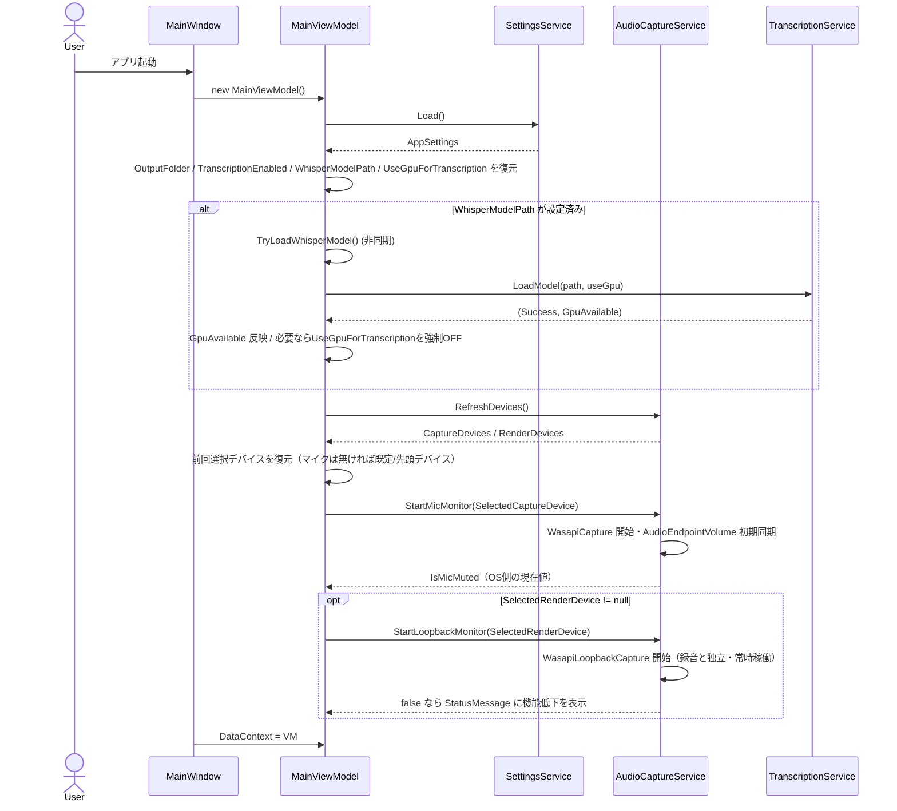
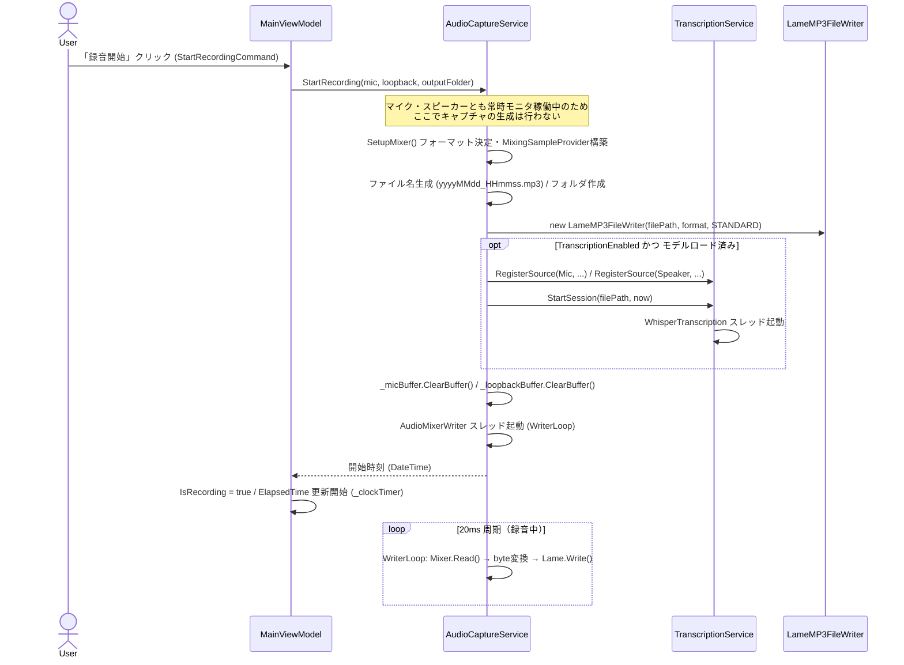
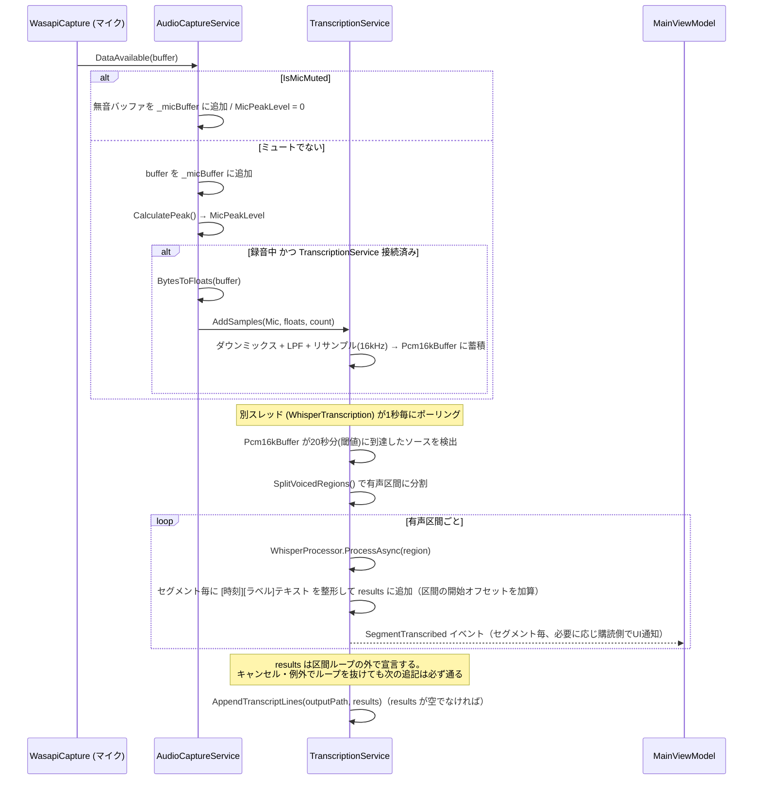
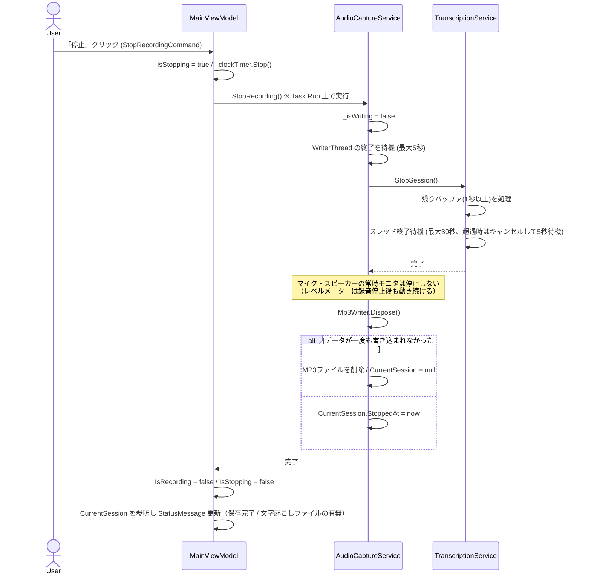
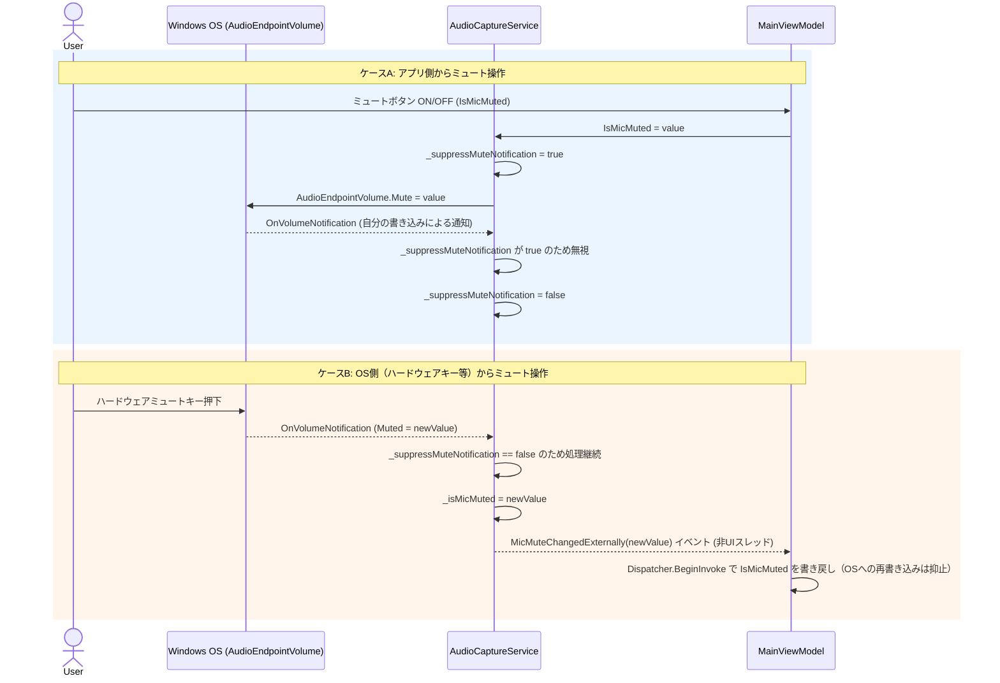
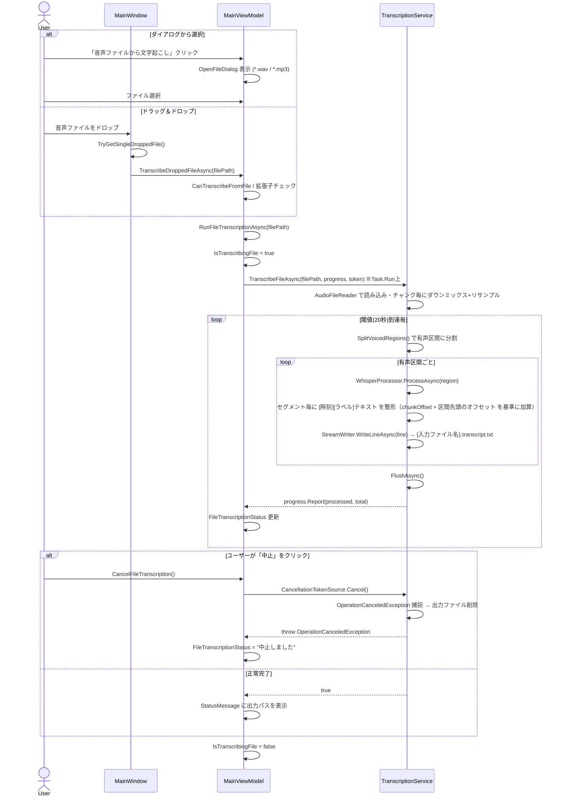
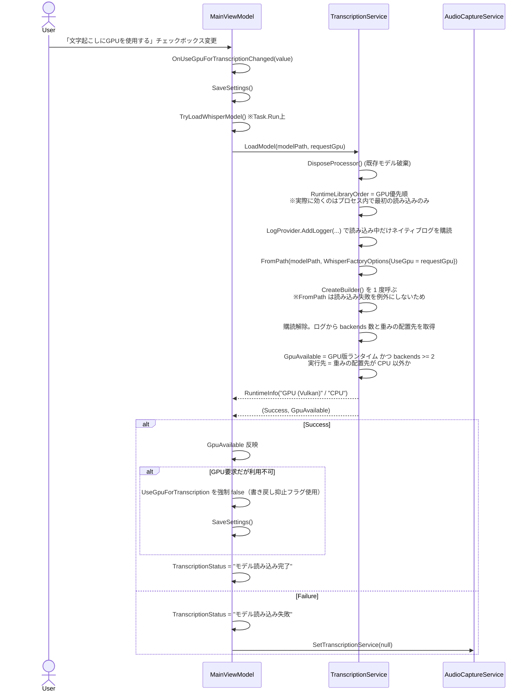

# シーケンス図

主要なユースケースについて、実装コードから読み取れる処理の流れを Mermaid シーケンス図で示す。

## 1. アプリ起動〜初期化

## 2. 録音開始

## 3. 録音中の音声取り込みと文字起こし連携

## 4. 録音停止

## 5. マイクミュートの双方向同期

## 6. ファイルからの文字起こし（ドラッグ＆ドロップ含む）

## 7. 文字起こし GPU 使用設定の切り替え

