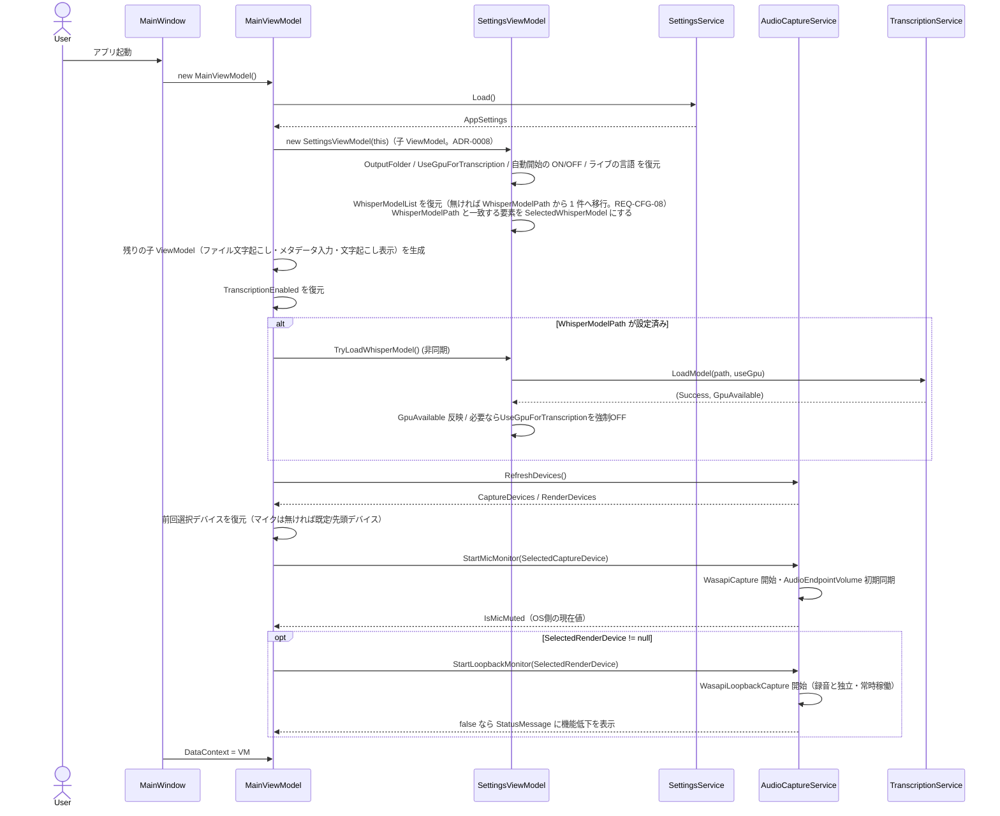
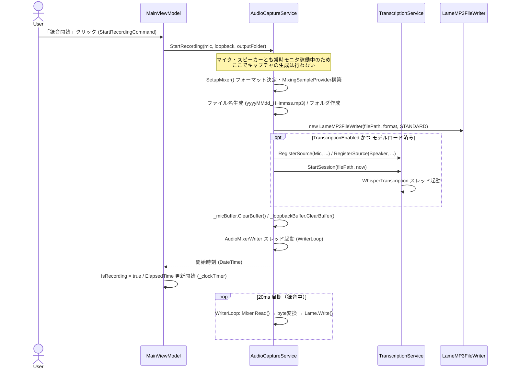
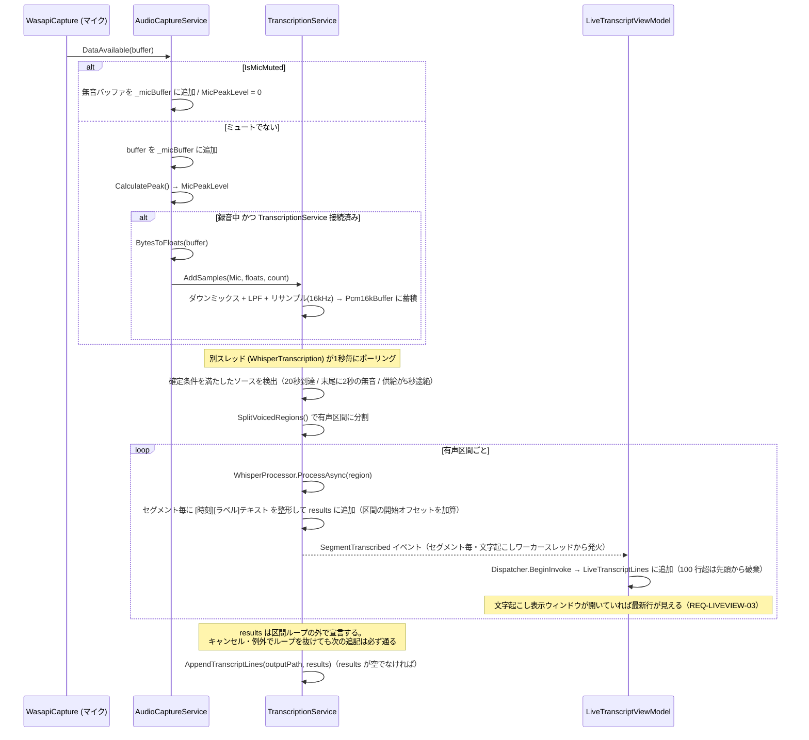
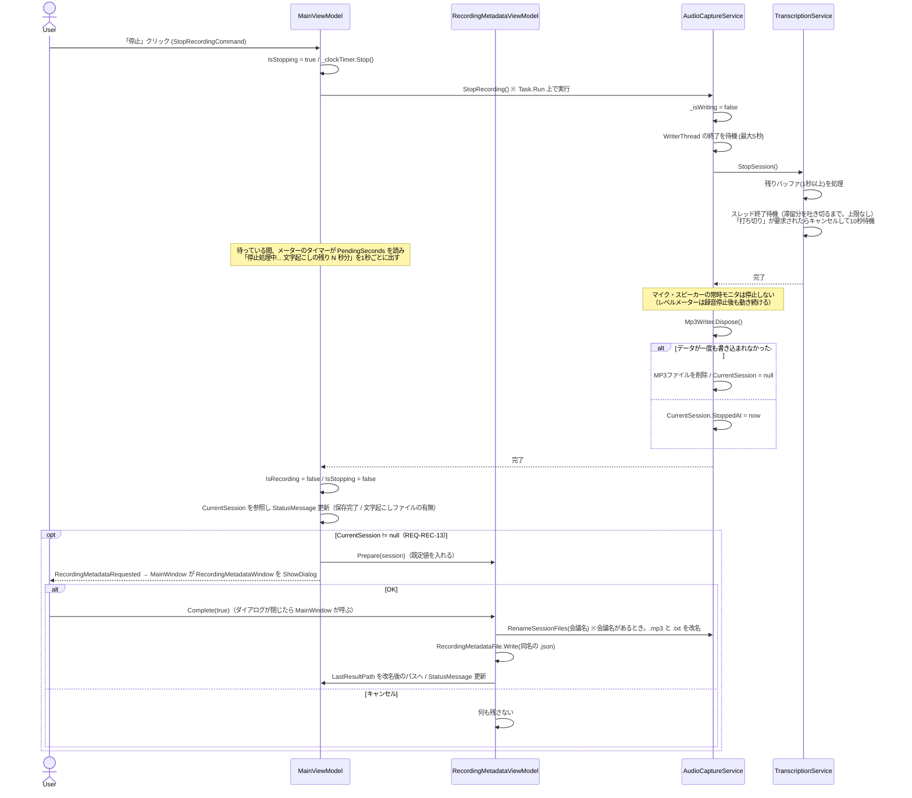
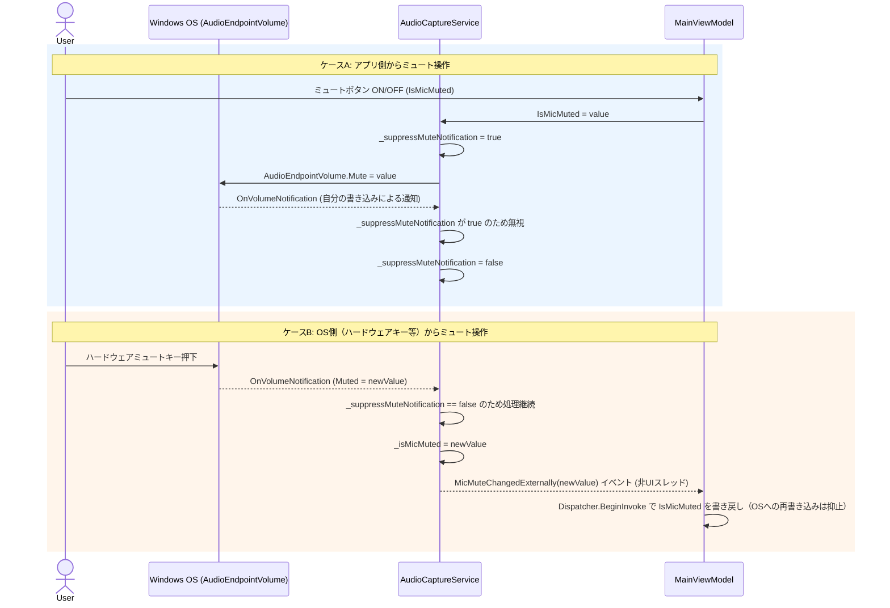
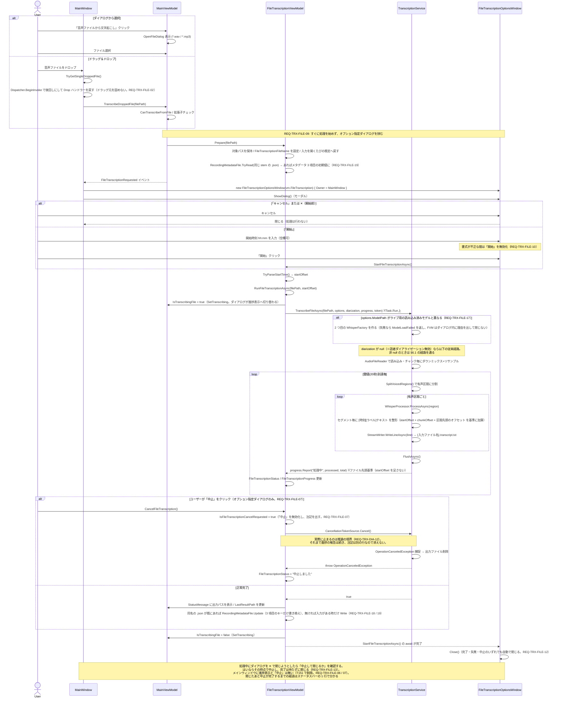
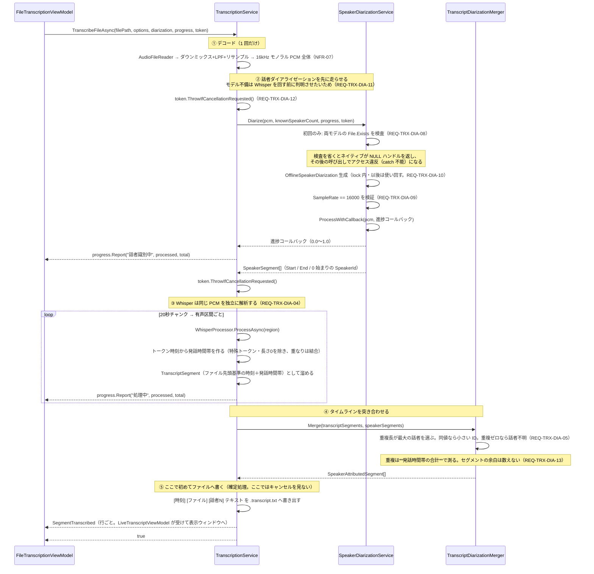
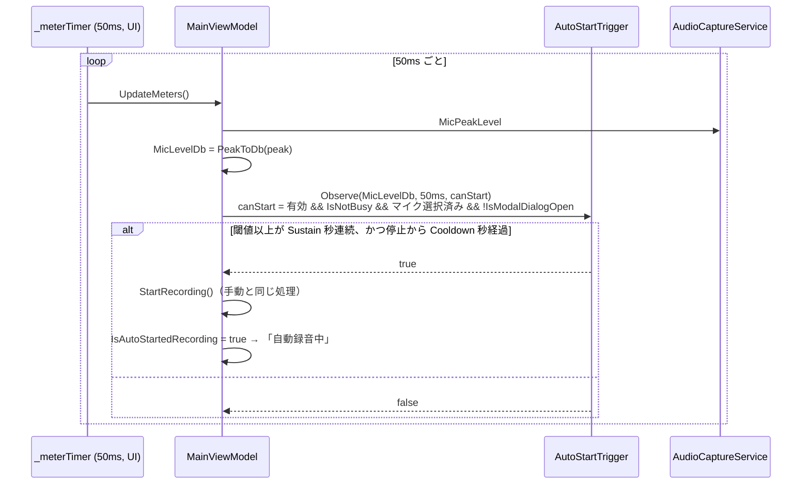
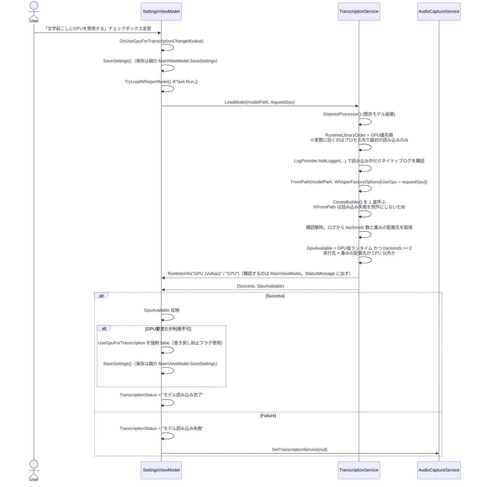

# シーケンス図

主要なユースケースについて、実装コードから読み取れる処理の流れを Mermaid シーケンス図で示す。

## 1. アプリ起動〜初期化

```mermaid
sequenceDiagram
    actor User
    participant MW as MainWindow
    participant VM as MainViewModel
    participant SVM as SettingsViewModel
    participant SS as SettingsService
    participant ACS as AudioCaptureService
    participant TS as TranscriptionService

    User->>MW: アプリ起動
    MW->>VM: new MainViewModel()
    VM->>SS: Load()
    SS-->>VM: AppSettings
    VM->>SVM: new SettingsViewModel(this)（子 ViewModel。ADR-0008）
    SVM->>SVM: OutputFolder / UseGpuForTranscription / 自動開始の ON/OFF / ライブの言語 を復元
    SVM->>SVM: WhisperModelList を復元（無ければ WhisperModelPath から 1 件へ移行。REQ-CFG-08）<br/>WhisperModelPath と一致する要素を SelectedWhisperModel にする
    VM->>VM: 残りの子 ViewModel（ファイル文字起こし・メタデータ入力・文字起こし表示）を生成
    VM->>VM: TranscriptionEnabled を復元

    alt WhisperModelPath が設定済み
        VM->>SVM: TryLoadWhisperModel() (非同期)
        SVM->>TS: LoadModel(path, useGpu)
        TS-->>SVM: (Success, GpuAvailable)
        SVM->>SVM: GpuAvailable 反映 / 必要ならUseGpuForTranscriptionを強制OFF
    end

    VM->>ACS: RefreshDevices()
    ACS-->>VM: CaptureDevices / RenderDevices
    VM->>VM: 前回選択デバイスを復元（マイクは無ければ既定/先頭デバイス）
    VM->>ACS: StartMicMonitor(SelectedCaptureDevice)
    ACS->>ACS: WasapiCapture 開始・AudioEndpointVolume 初期同期
    ACS-->>VM: IsMicMuted（OS側の現在値）

    opt SelectedRenderDevice != null
        VM->>ACS: StartLoopbackMonitor(SelectedRenderDevice)
        ACS->>ACS: WasapiLoopbackCapture 開始（録音と独立・常時稼働）
        ACS-->>VM: false なら StatusMessage に機能低下を表示
    end

    MW->>VM: DataContext = VM
```

## 2. 録音開始

```mermaid
sequenceDiagram
    actor User
    participant VM as MainViewModel
    participant ACS as AudioCaptureService
    participant TS as TranscriptionService
    participant Lame as LameMP3FileWriter

    User->>VM: 「録音開始」クリック (StartRecordingCommand)
    VM->>ACS: StartRecording(mic, loopback, outputFolder)
    Note over ACS: マイク・スピーカーとも常時モニタ稼働中のため<br/>ここでキャプチャの生成は行わない
    ACS->>ACS: SetupMixer() フォーマット決定・MixingSampleProvider構築
    ACS->>ACS: ファイル名生成 (yyyyMMdd_HHmmss.mp3) / フォルダ作成
    ACS->>Lame: new LameMP3FileWriter(filePath, format, STANDARD)

    opt TranscriptionEnabled かつ モデルロード済み
        ACS->>TS: RegisterSource(Mic, ...) / RegisterSource(Speaker, ...)
        ACS->>TS: StartSession(filePath, now)
        TS->>TS: WhisperTranscription スレッド起動
    end

    ACS->>ACS: _micBuffer.ClearBuffer() / _loopbackBuffer.ClearBuffer()
    ACS->>ACS: AudioMixerWriter スレッド起動 (WriterLoop)
    ACS-->>VM: 開始時刻 (DateTime)
    VM->>VM: IsRecording = true / ElapsedTime 更新開始 (_clockTimer)

    loop 20ms 周期（録音中）
        ACS->>ACS: WriterLoop: Mixer.Read() → byte変換 → Lame.Write()
    end
```

## 3. 録音中の音声取り込みと文字起こし連携

```mermaid
sequenceDiagram
    participant Mic as WasapiCapture (マイク)
    participant ACS as AudioCaptureService
    participant TS as TranscriptionService
    participant LTVM as LiveTranscriptViewModel

    Mic->>ACS: DataAvailable(buffer)
    alt IsMicMuted
        ACS->>ACS: 無音バッファを _micBuffer に追加 / MicPeakLevel = 0
    else ミュートでない
        ACS->>ACS: buffer を _micBuffer に追加
        ACS->>ACS: CalculatePeak() → MicPeakLevel
        alt 録音中 かつ TranscriptionService 接続済み
            ACS->>ACS: BytesToFloats(buffer)
            ACS->>TS: AddSamples(Mic, floats, count)
            TS->>TS: ダウンミックス + LPF + リサンプル(16kHz) → Pcm16kBuffer に蓄積
        end
    end

    Note over TS: 別スレッド (WhisperTranscription) が1秒毎にポーリング
    TS->>TS: 確定条件を満たしたソースを検出（20秒到達 / 末尾に2秒の無音 / 供給が5秒途絶）
    TS->>TS: SplitVoicedRegions() で有声区間に分割
    loop 有声区間ごと
        TS->>TS: WhisperProcessor.ProcessAsync(region)
        TS->>TS: セグメント毎に [時刻][ラベル]テキスト を整形して results に追加（区間の開始オフセットを加算）
        TS-->>LTVM: SegmentTranscribed イベント（セグメント毎・文字起こしワーカースレッドから発火）
        LTVM->>LTVM: Dispatcher.BeginInvoke → LiveTranscriptLines に追加（100 行超は先頭から破棄）
        Note over LTVM: 文字起こし表示ウィンドウが開いていれば最新行が見える（REQ-LIVEVIEW-03）
    end
    Note over TS: results は区間ループの外で宣言する。<br/>キャンセル・例外でループを抜けても次の追記は必ず通る
    TS->>TS: AppendTranscriptLines(outputPath, results)（results が空でなければ）
```

## 4. 録音停止

```mermaid
sequenceDiagram
    actor User
    participant VM as MainViewModel
    participant RMVM as RecordingMetadataViewModel
    participant ACS as AudioCaptureService
    participant TS as TranscriptionService

    User->>VM: 「停止」クリック (StopRecordingCommand)
    VM->>VM: IsStopping = true / _clockTimer.Stop()
    VM->>ACS: StopRecording() ※ Task.Run 上で実行

    ACS->>ACS: _isWriting = false
    ACS->>ACS: WriterThread の終了を待機 (最大5秒)
    ACS->>TS: StopSession()
    TS->>TS: 残りバッファ(1秒以上)を処理
    TS->>TS: スレッド終了待機（滞留分を吐き切るまで。上限なし）<br/>「打ち切り」が要求されたらキャンセルして10秒待機
    Note over VM: 待っている間、メーターのタイマーが PendingSeconds を読み<br/>「停止処理中... 文字起こしの残り N 秒分」を1秒ごとに出す
    TS-->>ACS: 完了

    Note over ACS: マイク・スピーカーの常時モニタは停止しない<br/>（レベルメーターは録音停止後も動き続ける）
    ACS->>ACS: Mp3Writer.Dispose()
    alt データが一度も書き込まれなかった
        ACS->>ACS: MP3ファイルを削除 / CurrentSession = null
    else
        ACS->>ACS: CurrentSession.StoppedAt = now
    end
    ACS-->>VM: 完了

    VM->>VM: IsRecording = false / IsStopping = false
    VM->>VM: CurrentSession を参照し StatusMessage 更新（保存完了 / 文字起こしファイルの有無）

    opt CurrentSession != null（REQ-REC-13）
        VM->>RMVM: Prepare(session)（既定値を入れる）
        VM-->>User: RecordingMetadataRequested → MainWindow が RecordingMetadataWindow を ShowDialog
        alt OK
            User->>RMVM: Complete(true)（ダイアログが閉じたら MainWindow が呼ぶ）
            RMVM->>ACS: RenameSessionFiles(会議名) ※会議名があるとき。.mp3 と .txt を改名
            RMVM->>RMVM: RecordingMetadataFile.Write(同名の .json)
            RMVM->>VM: LastResultPath を改名後のパスへ / StatusMessage 更新
        else キャンセル
            RMVM->>RMVM: 何も残さない
        end
    end
```

## 5. マイクミュートの双方向同期

```mermaid
sequenceDiagram
    actor User
    participant OS as Windows OS (AudioEndpointVolume)
    participant ACS as AudioCaptureService
    participant VM as MainViewModel

    rect rgb(235,245,255)
    Note over User,VM: ケースA: アプリ側からミュート操作
    User->>VM: ミュートボタン ON/OFF (IsMicMuted)
    VM->>ACS: IsMicMuted = value
    ACS->>ACS: _suppressMuteNotification = true
    ACS->>OS: AudioEndpointVolume.Mute = value
    OS-->>ACS: OnVolumeNotification (自分の書き込みによる通知)
    ACS->>ACS: _suppressMuteNotification が true のため無視
    ACS->>ACS: _suppressMuteNotification = false
    end

    rect rgb(255,245,235)
    Note over User,VM: ケースB: OS側（ハードウェアキー等）からミュート操作
    User->>OS: ハードウェアミュートキー押下
    OS-->>ACS: OnVolumeNotification (Muted = newValue)
    ACS->>ACS: _suppressMuteNotification == false のため処理継続
    ACS->>ACS: _isMicMuted = newValue
    ACS-->>VM: MicMuteChangedExternally(newValue) イベント (非UIスレッド)
    VM->>VM: Dispatcher.BeginInvoke で IsMicMuted を書き戻し（OSへの再書き込みは抑止）
    end
```

## 6. ファイルからの文字起こし（ドラッグ＆ドロップ含む）

```mermaid
sequenceDiagram
    actor User
    participant MW as MainWindow
    participant VM as MainViewModel
    participant FVM as FileTranscriptionViewModel
    participant TS as TranscriptionService

    participant OW as FileTranscriptionOptionsWindow

    alt ダイアログから選択
        User->>VM: 「音声ファイルから文字起こし」クリック
        VM->>VM: OpenFileDialog 表示 (*.wav / *.mp3)
        User->>VM: ファイル選択
    else ドラッグ＆ドロップ
        User->>MW: 音声ファイルをドロップ
        MW->>MW: TryGetSingleDroppedFile()
        MW->>MW: Dispatcher.BeginInvoke で後回しにして Drop ハンドラーを戻す（ドラッグ元を固めない。REQ-TRX-FILE-02）
        MW->>VM: TranscribeDroppedFile(filePath)
        VM->>VM: CanTranscribeFromFile / 拡張子チェック
    end

    Note over VM,OW: REQ-TRX-FILE-09: すぐに処理を始めず、オプション指定ダイアログを挟む
    VM->>FVM: Prepare(filePath)
    FVM->>FVM: 対象パスを保持 / FileTranscriptionFileName を設定 / 入力を開くたびの既定へ戻す
    FVM->>FVM: RecordingMetadataFile.TryRead(同じ stem の .json) → あればメタデータ 3 項目の初期値に（REQ-TRX-FILE-19）
    VM-->>MW: FileTranscriptionRequested イベント
    MW->>OW: new FileTranscriptionOptionsWindow(vm.FileTranscription) { Owner = MainWindow }
    MW->>OW: ShowDialog()（モーダル）

    alt 「キャンセル」または ✕（開始前）
        User->>OW: キャンセル
        OW-->>MW: 閉じる（処理は行わない）
    else 「開始」
        User->>OW: 開始時刻 hh:mm を入力（空欄可）
        Note over OW: 書式が不正な間は「開始」を無効化（REQ-TRX-FILE-10）
        User->>OW: 「開始」クリック
        OW->>FVM: StartFileTranscriptionAsync()
    end

    FVM->>FVM: TryParseStartTime() → startOffset
    FVM->>FVM: RunFileTranscriptionAsync(filePath, startOffset)
    FVM->>VM: IsTranscribingFile = true（SetTranscribing。ダイアログが進捗表示へ切り替わる）
    FVM->>TS: TranscribeFileAsync(filePath, options, diarization, progress, token) ※Task.Run上
    alt options.ModelPath がライブ用の読み込み済みモデルと異なる（REQ-TRX-FILE-17）
        TS->>TS: 2 つ目の WhisperFactory を作る（失敗なら ModelLoadFailed を返し、FVM はダイアログ内に理由を出して閉じない）
    end

    Note over TS: diarization が null（＝話者ダイアライゼーション無効）なら以下の従来経路。<br/>非 null のときは §6.1 の経路を通る
    TS->>TS: AudioFileReader で読み込み・チャンク毎にダウンミックス+リサンプル
    loop 閾値(20秒)到達毎
        TS->>TS: SplitVoicedRegions() で有声区間に分割
        loop 有声区間ごと
            TS->>TS: WhisperProcessor.ProcessAsync(region)
            TS->>TS: セグメント毎に [時刻][ラベル]テキスト を整形（startOffset + chunkOffset + 区間先頭のオフセット を基準に加算）
            TS->>TS: StreamWriter.WriteLineAsync(line) → {入力ファイル名}.transcript.txt
        end
        TS->>TS: FlushAsync()
        TS-->>FVM: progress.Report("処理中", processed, total) ※ファイル先頭基準（startOffset を足さない）
        FVM->>FVM: FileTranscriptionStatus / FileTranscriptionProgress 更新
    end

    alt ユーザーが「中止」をクリック（オプション指定ダイアログのみ。REQ-TRX-FILE-07）
        User->>FVM: CancelFileTranscription()
        FVM->>FVM: IsFileTranscriptionCancelRequested = true（「中止」を無効化し、注記を出す。REQ-TRX-FILE-07）
        FVM->>TS: CancellationTokenSource.Cancel()
        Note over FVM,TS: 実際に止まるのは推論の境界（REQ-TRX-DIA-12）。<br/>それまで進捗の報告は続き、注記は別の行なので消えない。
        TS->>TS: OperationCanceledException 捕捉 → 出力ファイル削除
        TS-->>FVM: throw OperationCanceledException
        FVM->>FVM: FileTranscriptionStatus = "中止しました"
    else 正常完了
        TS-->>FVM: true
        FVM->>VM: StatusMessage に出力パスを表示 / LastResultPath を更新
        FVM->>FVM: 同名の .json が既にあれば RecordingMetadataFile.Update（3 項目のキーだけ書き換え）、無ければ入力がある時だけ Write（REQ-TRX-FILE-18 / 19）
    end

    FVM->>VM: IsTranscribingFile = false（SetTranscribing）
    FVM-->>OW: StartFileTranscriptionAsync() の await が完了
    OW->>OW: Close()（完了・失敗・中止のいずれでも自動で閉じる。REQ-TRX-FILE-12）

    Note over MW,OW: 処理中にダイアログを ✕ で閉じようとしたら「中止して閉じるか」を確認する。<br/>はいならその時点で中止し、完了は待たずに閉じる（REQ-TRX-FILE-13）。<br/>メインウィンドウに進捗表示と「中止」は無い（T151 で削除。REQ-TRX-FILE-06 / 07）。<br/>閉じたあと中止が完了するまでの経過はステータスバーの 1 行で分かる
```

### 6.1 話者ダイアライゼーション有効時（REQ-TRX-DIA-*）

`SpeakerDiarizationEnabled = true` のときだけこの経路を通る。無効時は §6 の従来経路がそのまま走る。

```mermaid
sequenceDiagram
    participant FVM as FileTranscriptionViewModel
    participant TS as TranscriptionService
    participant SD as SpeakerDiarizationService
    participant M as TranscriptDiarizationMerger

    FVM->>TS: TranscribeFileAsync(filePath, options, diarization, progress, token)

    Note over TS: ① デコード（1 回だけ）
    TS->>TS: AudioFileReader → ダウンミックス+LPF+リサンプル → 16kHz モノラル PCM 全体（NFR-07）

    Note over TS,SD: ② 話者ダイアライゼーションを先に走らせる<br/>モデル不備は Whisper を回す前に判明させたいため（REQ-TRX-DIA-11）
    TS->>TS: token.ThrowIfCancellationRequested()（REQ-TRX-DIA-12）
    TS->>SD: Diarize(pcm, knownSpeakerCount, progress, token)
    SD->>SD: 初回のみ: 両モデルの File.Exists を検査（REQ-TRX-DIA-08）
    Note over SD: 検査を省くとネイティブが NULL ハンドルを返し、<br/>その後の呼び出しでアクセス違反（catch 不能）になる
    SD->>SD: OfflineSpeakerDiarization 生成（lock 内・以後は使い回す。REQ-TRX-DIA-10）
    SD->>SD: SampleRate == 16000 を検証（REQ-TRX-DIA-09）
    SD->>SD: ProcessWithCallback(pcm, 進捗コールバック)
    SD-->>TS: 進捗コールバック（0.0〜1.0）
    TS-->>FVM: progress.Report("話者識別中", processed, total)
    SD-->>TS: SpeakerSegment[]（Start / End / 0 始まりの SpeakerId）
    TS->>TS: token.ThrowIfCancellationRequested()

    Note over TS: ③ Whisper は同じ PCM を独立に解析する（REQ-TRX-DIA-04）
    loop 20秒チャンク → 有声区間ごと
        TS->>TS: WhisperProcessor.ProcessAsync(region)
        TS->>TS: トークン時刻から発話時間帯を作る（特殊トークン・長さ0を除き、重なりは結合）
        TS->>TS: TranscriptSegment（ファイル先頭基準の時刻＋発話時間帯）として溜める
        TS-->>FVM: progress.Report("処理中", processed, total)
    end

    Note over TS,M: ④ タイムラインを突き合わせる
    TS->>M: Merge(transcriptSegments, speakerSegments)
    M->>M: 重複長が最大の話者を選ぶ。同値なら小さい ID。重複ゼロなら話者不明（REQ-TRX-DIA-05）
    Note over M: 重複は**発話時間帯の合計**で測る。セグメントの余白は数えない（REQ-TRX-DIA-13）
    M-->>TS: SpeakerAttributedSegment[]

    Note over TS: ⑤ ここで初めてファイルへ書く（確定処理。ここではキャンセルを見ない）
    TS->>TS: [時刻] [ファイル] [話者N] テキスト を .transcript.txt へ書き出す
    TS-->>FVM: SegmentTranscribed（行ごと。LiveTranscriptViewModel が受けて表示ウィンドウへ）
    TS-->>FVM: true
```

> **逐次表示のタイミングが変わる。** 話者の割り当てはタイムライン全体が揃うまで確定できないため、
> 有効時の `SegmentTranscribed` は最後の書き出し（⑤）でまとめて発火する。無効時は従来どおり
> 1 セグメント確定するたびに発火する。
>
> **Diarization が失敗した場合は文字起こしごと中止する**（REQ-TRX-DIA-11）。
> 話者欄が黙って欠けた `.transcript.txt` を作らないためである。

## 7. 録音の自動開始（マイク音量）

```mermaid
sequenceDiagram
    participant Timer as _meterTimer (50ms, UI)
    participant VM as MainViewModel
    participant AT as AutoStartTrigger
    participant ACS as AudioCaptureService

    loop 50ms ごと
        Timer->>VM: UpdateMeters()
        VM->>ACS: MicPeakLevel
        VM->>VM: MicLevelDb = PeakToDb(peak)
        VM->>AT: Observe(MicLevelDb, 50ms, canStart)<br/>canStart = 有効 && IsNotBusy && マイク選択済み && !IsModalDialogOpen
        alt 閾値以上が Sustain 秒連続、かつ停止から Cooldown 秒経過
            AT-->>VM: true
            VM->>VM: StartRecording()（手動と同じ処理）
            VM->>VM: IsAutoStartedRecording = true → 「自動録音中」
        else
            AT-->>VM: false
        end
    end
```

## 8. 文字起こし GPU 使用設定の切り替え

```mermaid
sequenceDiagram
    actor User
    participant SVM as SettingsViewModel
    participant TS as TranscriptionService
    participant ACS as AudioCaptureService

    User->>SVM: 「文字起こしにGPUを使用する」チェックボックス変更
    SVM->>SVM: OnUseGpuForTranscriptionChanged(value)
    SVM->>SVM: SaveSettings()（保存は親の MainViewModel.SaveSettings）
    SVM->>SVM: TryLoadWhisperModel() ※Task.Run上

    SVM->>TS: LoadModel(modelPath, requestGpu)
    TS->>TS: DisposeProcessor() (既存モデル破棄)
    TS->>TS: RuntimeLibraryOrder = GPU優先順<br/>※実際に効くのはプロセス内で最初の読み込みのみ
    TS->>TS: LogProvider.AddLogger(...) で読み込み中だけネイティブログを購読
    TS->>TS: FromPath(modelPath, WhisperFactoryOptions{UseGpu = requestGpu})
    TS->>TS: CreateBuilder() を 1 度呼ぶ<br/>※FromPath は読み込み失敗を例外にしないため
    TS->>TS: 購読解除。ログから backends 数と重みの配置先を取得
    TS->>TS: GpuAvailable = GPU版ランタイム かつ backends >= 2<br/>実行先 = 重みの配置先が CPU 以外か
    TS-->>SVM: RuntimeInfo("GPU (Vulkan)" / "CPU")（購読するのは MainViewModel。StatusMessage に出す）
    TS-->>SVM: (Success, GpuAvailable)

    alt Success
        SVM->>SVM: GpuAvailable 反映
        alt GPU要求だが利用不可
            SVM->>SVM: UseGpuForTranscription を強制 false（書き戻し抑止フラグ使用）
            SVM->>SVM: SaveSettings()（保存は親の MainViewModel.SaveSettings）
        end
        SVM->>SVM: TranscriptionStatus = "モデル読み込み完了"
    else Failure
        SVM->>SVM: TranscriptionStatus = "モデル読み込み失敗"
        SVM->>ACS: SetTranscriptionService(null)
    end
```
